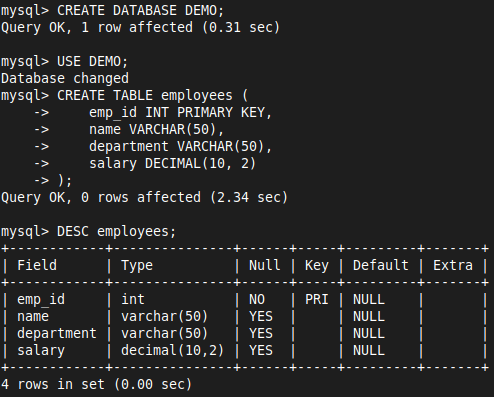
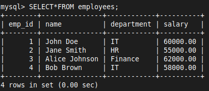
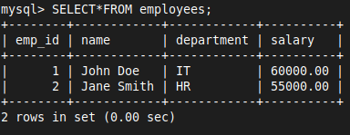
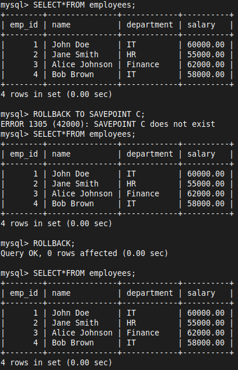

# 12 SQL - TCL

# Transaction Control Language (TCL) in SQL
- TCL commands are used to manage transactions in a database
- A transaction is a sequence of operations performed as a single logical unit of work.
- If any operation within a transaction fails, the entire transaction can be rolled back to ensure data integrity

The primary TCL commands are:

- **COMMIT**: Saves the changes made by the transaction permanently to the database
- **ROLLBACK**: Reverts the changes made by the transaction to the last committed state
- **SAVEPOINT**: Sets a point within a transaction to which a rollback can be performed

### Example Scenario: Employee Database

Let's consider a simple `Employee` database with a table `employees`:

```sql
CREATE TABLE employees (
    emp_id INT PRIMARY KEY,
    name VARCHAR(50),
    department VARCHAR(50),
    salary DECIMAL(10, 2)
);
```



### Step 1: Inserting Records and Using Savepoints

```SQL
-- Start a transaction
START TRANSACTION;
```

```sql
INSERT INTO employees (emp_id, name, department, salary) 
VALUES (1, 'John Doe', 'IT', 60000);

-- Set SAVEPOINT A
SAVEPOINT A;
```

```SQL
INSERT INTO employees (emp_id, name, department, salary) 
VALUES (2, 'Jane Smith', 'HR', 55000);

-- Set SAVEPOINT B
SAVEPOINT B;
```

```SQL
INSERT INTO employees (emp_id, name, department, salary) 
VALUES (3, 'Alice Johnson', 'Finance', 62000);

-- Set SAVEPOINT C
SAVEPOINT C;
```

```SQL
INSERT INTO employees (emp_id, name, department, salary) 
VALUES (4, 'Bob Brown', 'IT', 58000);
```



### Step 2: Using ROLLBACK

- Let's say we made a mistake with the last insertion and want to undo it:

```sql
ROLLBACK TO SAVEPOINT C;
```


```sql
-- Rollback to SAVEPOINT B
ROLLBACK TO SAVEPOINT B;
```



- If you want to undo all changes since the beginning of the transaction:

```sql
-- Rollback to the start of the transaction
ROLLBACK;
```


### Step 3: COMMIT to Save Changes

- If everything looks good, you can save all the changes:

```sql
COMMIT;
```

- This will save all the changes made after the last commit (or start of the transaction) permanently in the database.



### Autocommit in SQL
- **Autocommit** is a mode in SQL where each individual SQL statement is treated as a transaction and is automatically committed after it is executed
- In most database systems, autocommit is turned on by default

#### Example of Autocommit:

- Autocommit is usually ON by default

```sql
INSERT INTO employees (emp_id, name, department, salary) 
VALUES (5, 'David Green', 'Marketing', 50000);
```

- This insertion is automatically committed to the database
- If autocommit is disabled, you would need to manually commit each transaction:

```SQL
-- Disable autocommit
SET AUTOCOMMIT = 0;
```

```SQL
-- Start a transaction
START TRANSACTION;
```

```sql
INSERT INTO employees (emp_id, name, department, salary) 
VALUES (6, 'Emily White', 'Sales', 48000);
```

```SQL
-- Changes are not saved until you commit
COMMIT;
```

```SQL
-- Re-enable autocommit
SET AUTOCOMMIT = 1;
```
