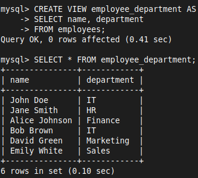
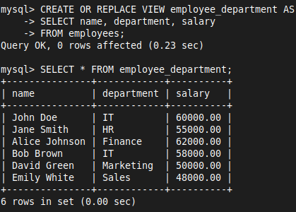
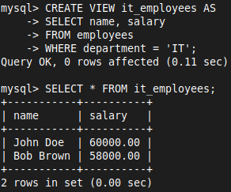
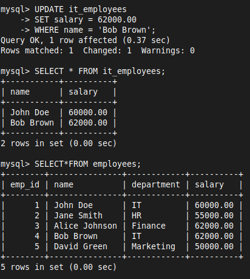
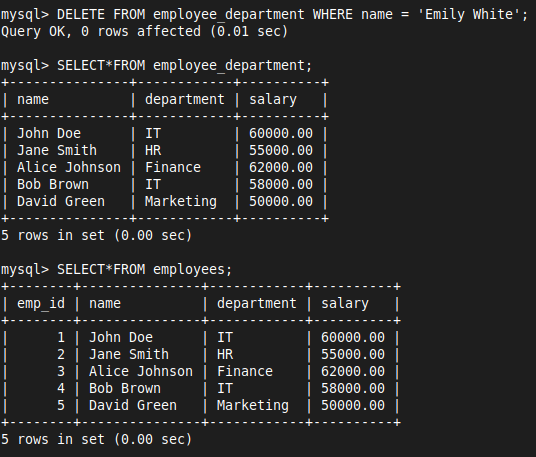

# 14 View

- A **VIEW** in SQL is a virtual table that is based on the result of a SQL query
- It does not store data itself but presents data from one or more tables, making it easier to manage and query complex data

### 1. **Creating a Simple VIEW**
- Suppose you want to create a view that shows only the `name` and `department` of employees from the `employees` table

```sql
CREATE VIEW employee_department AS
SELECT name, department
FROM employees;
```

- You can query the `employee_department` view just like a regular table

```sql
SELECT * FROM employee_department;
```



### 2. **Using REPLACE in the CREATE VIEW Statement**

```sql
CREATE OR REPLACE VIEW employee_department AS
SELECT name, department, salary
FROM employees;
```



### 3. **Creating a VIEW with Filtered Data**

```sql
CREATE VIEW it_employees AS
SELECT name, salary
FROM employees
WHERE department = 'IT';
```



### 4. **Updating Data through a VIEW**

```sql
UPDATE it_employees
SET salary = 62000.00
WHERE name = 'Bob Brown';
```



### 5. **DELETE Command**

- You can delete records from the base table through a view

```sql
DELETE FROM employee_department WHERE name = 'Emily White';
```



### 6. **Conditions for INSERT on a View**
1. **Simple Views:**
	-  The view must be simple, meaning it should be based on a single table without any joins, groupings, or aggregate functions
2. **All NOT NULL Columns Included:** 
	-  The view should include all columns that are `NOT NULL` in the base table, unless those columns have default values
3. **No Calculated Fields:** 
	- The view should not include any calculated fields or derived columns
4. **No Distinct or Group By:** 
	- The view should not use `DISTINCT`, `GROUP BY`, or similar clauses that could alter the data structure

### 7. **Dropping a VIEW**

```sql
DROP VIEW it_employees;
```
