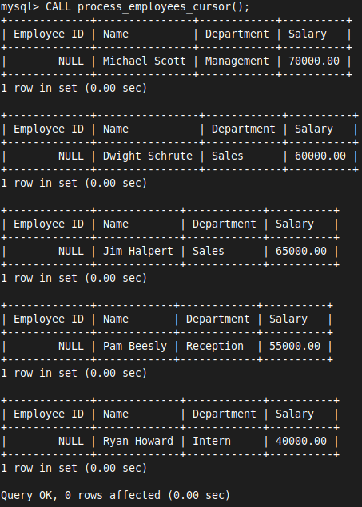

# 17 PL-SQL - Cursor

- In MySQL, a cursor is a database object used to retrieve, manipulate, and navigate through rows of a result set one at a time
- Cursors are particularly useful when you need to perform operations row-by-row rather than on the entire result set at once

### Key Concepts of Cursors
1. **Declaration**
	- Before using a cursor, you need to declare it
	- This involves specifying the SQL query whose results the cursor will handle

  ```sql
   DECLARE my_cursor CURSOR FOR
   SELECT emp_id, name, department, salary FROM employees;
   ```

2. **Open**
	- After declaring a cursor, you open it to establish the result set and make it available for fetching rows

   ```sql
   OPEN my_cursor;
   ```

3. **Fetch**
	- This operation retrieves the next row from the result set into variables
	- You fetch one row at a time and process it

   ```sql
   FETCH my_cursor INTO @emp_id, @name, @department, @salary;
   ```

4. **Close**
	- Once you are done processing the rows, you close the cursor to release resources and avoid potential memory leaks

   ```sql
   CLOSE my_cursor;
   ```
   
### Example of Cursor (Stored Procedure)
- Here’s an example of a stored procedure using a cursor to iterate through employee records

```sql
DELIMITER //

CREATE PROCEDURE process_employees_cursor()
BEGIN
    DECLARE done INT DEFAULT FALSE;
    DECLARE emp_id INT;
    DECLARE emp_name VARCHAR(100);
    DECLARE emp_department VARCHAR(50);
    DECLARE emp_salary DECIMAL(10, 2);

	-- Step 1 : Declare Cursor
    DECLARE cur CURSOR FOR
        SELECT emp_id, name, department, salary FROM employees;
    DECLARE CONTINUE HANDLER FOR NOT FOUND SET done = TRUE;

	-- Step 2 : Open Cursor
    OPEN cur;

	-- Step 3 : Fetch
    read_loop: LOOP
        FETCH cur INTO emp_id, emp_name, emp_department, emp_salary;
        IF done THEN
            LEAVE read_loop;
        END IF;
        -- Process each row here
        SELECT emp_id, emp_name, emp_department, emp_salary;
    END LOOP;

	-- Step 4 : Close Cursor
    CLOSE cur;
END//

DELIMITER ;
```

- A cursor named `cur` is declared to select all columns from the `employees` table
- The `CONTINUE HANDLER` handles the end-of-data condition by setting the `done` flag to `TRUE`
- The `read_loop` processes each row fetched by the cursor
- After processing all rows, the cursor is closed


