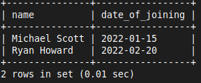

# 18 Advanced SQL

# 1. Transactions and ACID Properties

#### ACID Properties
1. **Atomicity**: Ensures that all operations within a transaction are completed successfully. If not, the transaction is aborted
2. **Consistency**: Ensures that the database transitions from one valid state to another
3. **Isolation**: Ensures that transactions are isolated from each other
4. **Durability**: Ensures that once a transaction is committed, it remains so, even in the event of a system failure

**Example of Transactions**
- Let's say we want to transfer a salary amount from one employee to another
- We'll use transactions to ensure the operation is atomic and consistent

```sql
START TRANSACTION;
```

```sql
UPDATE employees
SET salary = salary - 5000
WHERE name = 'Michael Scott';
```

```sql
UPDATE employees
SET salary = salary + 5000
WHERE name = 'Ryan Howard';
```

```sql
-- Check if both operations are successful
SELECT * FROM employees WHERE name IN ('Michael Scott', 'Ryan Howard');
```


```sql
-- If everything is correct, commit the transaction
COMMIT;
```

- If any error occurs during the transaction, you can roll it back:

```sql
ROLLBACK;
```


# 2. Working with Dates and Strings

#### Dates

```sql
ALTER TABLE employees ADD COLUMN date_of_joining DATE;
```

```sql
UPDATE employees
SET date_of_joining = '2022-01-15' WHERE name = 'Michael Scott';
```

```sql
UPDATE employees
SET date_of_joining = '2022-02-20' WHERE name = 'Ryan Howard';
```

```sql
SELECT * FROM employees WHERE name IN ('Michael Scott', 'Ryan Howard');
```


**Example Queries:**

```sql
UPDATE employees 
SET date_of_joining = '2022-03-01' 
WHERE emp_id BETWEEN 2 AND 4;
```

- **Finding employees who joined in 2022:**
```sql
SELECT name, date_of_joining
FROM employees
WHERE YEAR(date_of_joining) = 2022;
```



- **Calculating the number of days since each employee joined:**
```sql
SELECT name, DATEDIFF(CURDATE(), date_of_joining) AS days_since_joining
FROM employees;
```


#### Strings

**Example Queries:**

- **Concatenating first and last names:**
```sql
ALTER TABLE employees ADD COLUMN first_name VARCHAR(50);
ALTER TABLE employees ADD COLUMN last_name VARCHAR(50);
```

```sql
UPDATE employees
SET first_name = 'Michael', last_name = 'Scott'
WHERE name = 'Michael Scott';
```

```sql
SELECT CONCAT(first_name, ' ', last_name) AS full_name
FROM employees;
```


# 3. Indexes and Performance Tuning

#### 01 Creating Indexes
- Indexes can improve the performance of queries
- Let's create an index on the `department` column

```sql
CREATE INDEX idx_department ON employees(department);
```

#### 02 Example of Performance Improvement
- Without index:
```sql
EXPLAIN SELECT * FROM employees WHERE department = 'IT';
```

- With index:
```sql
EXPLAIN SELECT * FROM employees WHERE department = 'IT';
```

- You should see a lower execution cost with the index


#### 03 Dropping an Index
- If an index is no longer needed, it can be dropped:

```sql
DROP INDEX idx_department ON employees;
```

#### 04 Using Indexes for Composite Keys
- You can also create composite indexes on multiple columns for more complex queries:

```sql
CREATE INDEX idx_department_salary ON employees(department, salary);
```
