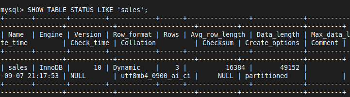

# 20 Advanced Topics

# 1. **Normalization v/s Denormalization**

**Normalization**
- Normalization is a process of organizing data in a database to reduce redundancy and improve data integrity
- It involves dividing a database into two or more tables and defining relationships between the tables
- The main goals of normalization are to eliminate redundant data, ensure data dependencies make sense, and reduce the potential for data anomalies

**Example**
- Consider a university database with information about students, courses, and enrollments

**Before Normalization**

| StudentID | StudentName | CourseID | CourseName | Professor |
|-----------|-------------|----------|------------|-----------|
| 1         | Alice       | C101     | Math       | Dr. Smith |
| 2         | Bob         | C102     | Physics    | Dr. Johnson |
| 1         | Alice       | C103     | Chemistry  | Dr. Lee   |

**After Normalization** (3NF)

**Students Table**

| StudentID | StudentName |
|-----------|-------------|
| 1         | Alice       |
| 2         | Bob         |

**Courses Table**

| CourseID | CourseName | Professor   |
|----------|------------|-------------|
| C101     | Math       | Dr. Smith   |
| C102     | Physics    | Dr. Johnson |
| C103     | Chemistry  | Dr. Lee     |

**Enrollments Table**

| StudentID | CourseID |
|-----------|----------|
| 1         | C101     |
| 2         | C102     |
| 1         | C103     |

**Denormalization**
- Denormalization is the process of combining normalized tables into a single table to improve read performance
- This can lead to redundant data and potential anomalies but can significantly speed up data retrieval

**Example**
- Consider the same university database
- To improve read performance for a specific query, we might combine the Students, Courses, and Enrollments tables back into a single table

**After Denormalization**

| StudentID | StudentName | CourseID | CourseName | Professor   |
|-----------|-------------|----------|------------|-------------|
| 1         | Alice       | C101     | Math       | Dr. Smith   |
| 2         | Bob         | C102     | Physics    | Dr. Johnson |
| 1         | Alice       | C103     | Chemistry  | Dr. Lee     |


# 2. **Advanced Query Optimization**
- Advanced query optimization involves techniques to improve the performance of SQL queries
- This can include indexing, query rewriting, and using execution plans

**Example**
- Suppose we have a table `orders` with millions of rows, and we frequently query orders by `customer_id`

**Initial Query**
```sql
SELECT * FROM orders WHERE customer_id = 12345;
```

**Optimization Techniques**
- **Indexing**: Create an index on the `customer_id` column
```sql
CREATE INDEX idx_customer_id ON orders (customer_id);
```

- **Query Rewriting**: Simplify complex queries to make them more efficient
```sql
SELECT order_id, order_date FROM orders WHERE customer_id = 12345;
```

- **Execution Plan**: Analyze the query execution plan to identify bottlenecks
```sql
EXPLAIN SELECT * FROM orders WHERE customer_id = 12345;
```


# 3. **Partitioning Tables**
- Partitioning is a database design technique that divides a large table into smaller, more manageable pieces called partitions
- Each partition is a subset of the table's data, and queries can be optimized to only scan the relevant partitions, thus improving performance

### Types of Partitioning
1. **Range Partitioning**: Data is divided based on a range of values
2. **List Partitioning**: Data is divided based on a list of values
3. **Hash Partitioning**: Data is divided based on a hash function
4. **Key Partitioning**: Similar to hash partitioning but uses the table's primary key

### Example Scenario
- Consider a large `sales` table that contains millions of rows
- To optimize query performance, we can partition this table by the year of the `sale_date` column

### 01 Range Partitioning Example
1. Step 1: Create the Partitioned Table
	- We'll create a `sales` table partitioned by year

```sql
CREATE TABLE sales (
    sale_id INT,
    sale_date DATE,
    amount DECIMAL(10, 2)
) PARTITION BY RANGE (YEAR(sale_date)) (
    PARTITION p2021 VALUES LESS THAN (2022) COMMENT = 'Data for the year 2021',
    PARTITION p2022 VALUES LESS THAN (2023) COMMENT = 'Data for the year 2022',
    PARTITION p2023 VALUES LESS THAN (2024) COMMENT = 'Data for the year 2023'
);
```

- **PARTITION BY RANGE (YEAR(sale_date))**: Partitions the table by the year extracted from the `sale_date` column
- **PARTITION p2021 VALUES LESS THAN (2022)**: All sales with a year less than 2022 are stored in the `p2021` partition
- **PARTITION p2022 VALUES LESS THAN (2023)**: All sales with a year less than 2023 are stored in the `p2022` partition
- **PARTITION p2023 VALUES LESS THAN (2024)**: All sales with a year less than 2024 are stored in the `p2023` partition

2. Step 2: Insert Data into the Partitioned Table

3. Step 3: Query the Partitioned Table
	- When querying the partitioned table, the database will only scan the relevant partitions, improving performance

```sql
SELECT * FROM sales WHERE sale_date BETWEEN '2022-01-01' AND '2022-12-31';
```

- In this example, the database will only scan the `p2022` partition because the query is filtering by the year 2022

```sql
-- Viewing data in partition p2021
SELECT * FROM sales WHERE YEAR(sale_date) < 2022;
```

```sql
-- Viewing data in partition p2022
SELECT * FROM sales WHERE YEAR(sale_date) >= 2022 AND YEAR(sale_date) < 2023;
```

```sql
-- Viewing data in partition p2023
SELECT * FROM sales WHERE YEAR(sale_date) >= 2023 AND YEAR(sale_date) < 2024;
```


### Viewing Partition Information
1. **Using `SHOW TABLE STATUS`**
	- This command provides general information about the `sales` table, including whether it is partitioned

```sql
SHOW TABLE STATUS LIKE 'sales';
```




2. **Using `INFORMATION_SCHEMA.PARTITIONS`**
	- To get detailed information about the partitions, you can query the `INFORMATION_SCHEMA.PARTITIONS` table
	- This query will give you information about each partition in the `sales` table

```sql
SELECT
    PARTITION_NAME,
    TABLE_ROWS,
    DATA_LENGTH,
    INDEX_LENGTH,
    PARTITION_COMMENT
FROM
    INFORMATION_SCHEMA.PARTITIONS
WHERE
    TABLE_SCHEMA = 'DEMO' AND
    TABLE_NAME = 'sales';
```


### 02 List Partitioning Example
- MySQL expects integer values for the list partition
- This is because MySQL does not support list partitioning with non-integer types directly

1. Step 1: Create the Partitioned Table
	- We'll create a `sales` table partitioned by the region

```sql
CREATE TABLE sales (
    sale_id INT,
    sale_date DATE,
    amount DECIMAL(10, 2),
    region VARCHAR(50),
    region_id INT
) PARTITION BY LIST (region_id) (
    PARTITION p_north VALUES IN (1),
    PARTITION p_south VALUES IN (2),
    PARTITION p_east VALUES IN (3),
    PARTITION p_west VALUES IN (4)
);
```

- **PARTITION BY LIST (region)**: Partitions the table by the `region` column
- **PARTITION p_north VALUES IN ('North')**: All sales in the 'North' region are stored in the `p_north` partition
- **PARTITION p_south VALUES IN ('South')**: All sales in the 'South' region are stored in the `p_south` partition
- **PARTITION p_east VALUES IN ('East')**: All sales in the 'East' region are stored in the `p_east` partition
- **PARTITION p_west VALUES IN ('West')**: All sales in the 'West' region are stored in the `p_west` partition

2. Step 2: Insert Data into the Partitioned Table

3. Step 3: Query the Partitioned Table
	- When querying the partitioned table, the database will only scan the relevant partitions, improving performance

```sql
SELECT
    PARTITION_NAME,
    TABLE_ROWS,
    PARTITION_COMMENT
FROM
    INFORMATION_SCHEMA.PARTITIONS
WHERE
    TABLE_SCHEMA = 'DEMO' AND
    TABLE_NAME = 'sales';
```


### 03 Hash Partitioning Example

1. Step 1: Create the Partitioned Table
	- We'll create a `sales` table partitioned by hashing the `sale_id`

```sql
CREATE TABLE sales (
    sale_id INT,
    sale_date DATE,
    amount DECIMAL(10, 2)
) PARTITION BY HASH (sale_id) PARTITIONS 4;
```

- **PARTITION BY HASH (sale_id)**: Partitions the table by hashing the `sale_id` column
- **PARTITIONS 4**: Creates 4 partitions, with the rows distributed among them based on the hash value of `sale_id`

2. Step 2: Insert Data into the Partitioned Table

3. Step 3: Query the Partitioned Table

```sql
SELECT * FROM sales WHERE sale_id = 2;
```

- In this example, the database will calculate the hash value of `sale_id = 2` and scan only the relevant partition

```sql
SELECT
    PARTITION_NAME,
    TABLE_ROWS
FROM
    INFORMATION_SCHEMA.PARTITIONS
WHERE
    TABLE_SCHEMA = 'DEMO' AND
    TABLE_NAME = 'sales';
```


### Benefits of Partitioning
- **Improved Query Performance**: Queries can be optimized to scan only relevant partitions
- **Easier Maintenance**: Smaller partitions are easier to manage, back up, and restore
- **Enhanced Manageability**: Maintenance operations like archiving and purging old data can be performed on individual partitions without affecting the entire table

### Subpartitioning
- In MySQL, you cannot directly apply two different types of partitioning (such as range and list partitioning) on a single table
- However, you can achieve similar functionality using subpartitioning, which allows you to first partition your table by one method (e.g., range) and then subpartition each partition by another method (e.g., list)
### Supported Partitioning and Subpartitioning Types in MySQL
1. **Range Partitioning**: Divides data into partitions based on a range of values
    - **Subpartitioning**: You can use `HASH` or `KEY` partitioning on subpartitions
2. **List Partitioning**: Divides data based on a list of discrete values
    - **Subpartitioning**: You can use `HASH` or `KEY` partitioning on subpartitions


# 4. **Handling Large Datasets**
- Handling large datasets involves techniques to manage and query vast amounts of data efficiently
- This includes sharding, indexing, and using big data technologies

**Example**
- Consider a `log_entries` table with billions of rows

- **Sharding**: Distribute the data across multiple database servers
- **Indexing**: Create indexes on frequently queried columns

```sql
CREATE INDEX idx_log_date ON log_entries (log_date);
```

- **Big Data Technologies**: Use technologies like Hadoop or Spark for distributed data processing


# 5. **NoSQL Integration**
- NoSQL databases are designed to handle unstructured data, providing flexibility and scalability
- Integrating NoSQL with relational databases can leverage the strengths of both

**Example**
- Consider an e-commerce application with product catalog data in a relational database and user activity logs in a NoSQL database

**Relational Database**
- Products Table

| product_id | product_name | price  |
|------------|--------------|--------|
| 1          | Laptop       | 1000.00|
| 2          | Smartphone   | 500.00 |

- **NoSQL Database**: User Activity Collection (MongoDB)

```json
[
  {
    "user_id": "u123",
    "activity": "view",
    "product_id": "1",
    "timestamp": "2023-01-01T10:00:00Z"
  },
  {
    "user_id": "u124",
    "activity": "purchase",
    "product_id": "2",
    "timestamp": "2023-01-02T11:00:00Z"
  }
]
```

- We will learn about **NoSQL - MongoDB** deeply in **DBMS-NoSQL-MongoDB-Solutions**