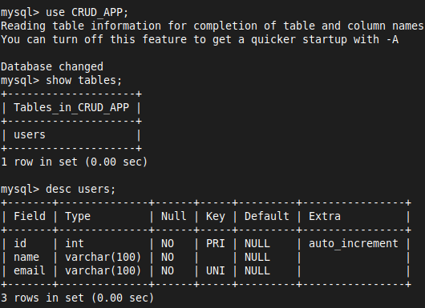
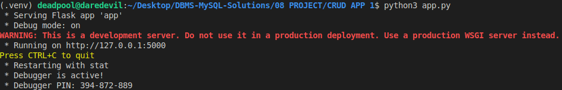
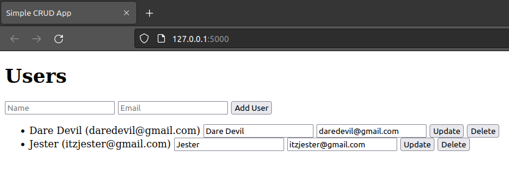
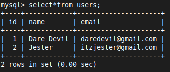

# CRUD APPLICATION Using MySQL & Flask

- Building a simple CRUD (Create, Read, Update, Delete) application with MySQL 
### Prerequisites
1. **MySQL**: Ensure MySQL is installed and running
2. **Python**: Install Python and pip
3. **Flask**: Install Flask using `pip install Flask`
4. **Flask-MySQLdb**: Install this package using `pip install flask-mysqldb`

### Step-by-Step Guide

```bash
 pip install flask flask-mysqldb
```

#### 1. Set Up the MySQL Database

```sql
CREATE DATABASE CRUD_APP;
USE CRUD_APP;
```

```sql
CREATE TABLE users (
    id INT AUTO_INCREMENT PRIMARY KEY,
    name VARCHAR(100) NOT NULL,
    email VARCHAR(100) NOT NULL UNIQUE
);
```




#### 2. Create the Flask Application
- Create a new directory for your project and inside that directory, create a file named `app.py`

```python
from flask import Flask, request, jsonify, render_template, redirect, url_for
from flask_mysqldb import MySQL
```

- **Flask**: This is the main package for creating a Flask web application
- **request**: This module is used to handle incoming requests, such as form data from POST requests
- **jsonify**: This function converts Python dictionaries into JSON responses
- **render_template**: This function renders HTML templates
- **redirect**: This function redirects the user to a different route
- **url_for**: This function helps in building a URL to a specific function
- **MySQL**: This is the Flask extension for connecting to a MySQL database using `flask_mysqldb`


```python
app = Flask(__name__)
```

- This is the Flask application instance
- It's the central object that tells Flask how to handle requests and what to do with them


```python
# MySQL configurations
app.config['MYSQL_HOST'] = 'localhost'
app.config['MYSQL_USER'] = 'root'
app.config['MYSQL_PASSWORD'] = 'mysql'
app.config['MYSQL_DB'] = 'DEMO'
```

- **app.config**: This dictionary stores configuration variables for the Flask app
    - `MYSQL_HOST`: The hostname where your MySQL server is running
    - `MYSQL_USER`: The MySQL user to connect as
    - `MYSQL_PASSWORD`: The password for the MySQL user
    - `MYSQL_DB`: The database name to use


```python
mysql = MySQL(app)
```

- **MySQL(app)**: This initializes the MySQL extension with the given Flask app


```python
@app.route('/')
def index():
    cur = mysql.connection.cursor()
    cur.execute('SELECT * FROM users')
    users = cur.fetchall()
    cur.close()
    return render_template('index.html', users=users)
```

- @app.route('/')
	- This decorator registers the URL `/` (the root of the site) to the `index` function
- **mysql.connection.cursor()**
	- creates a new cursor to interact with the database
- **cur.execute('SELECT * FROM users')**
	- executes a SQL query to select all records from the `users` table
- **cur.fetchall()**
	- fetches all the results of the executed query
- **cur.close()**: closes the cursor
- **render_template('index.html', users=users)**
	- renders the `index.html` template, passing the retrieved `users` data to it


```python
@app.route('/add', methods=['POST'])
def add_user():
    name = request.form['name']
    email = request.form['email']
    cur = mysql.connection.cursor()
    cur.execute('INSERT INTO users (name, email) VALUES (%s, %s)', (name, email))
    mysql.connection.commit()
    cur.close()
    return redirect(url_for('index'))
```

- @app.route('/add', methods=['POST'])
	- This decorator registers the URL `/add` to the `add_user` function and specifies it accepts POST requests

- **request.form['name']**: retrieves the `name` field from the submitted form
- **request.form['email']**: retrieves the `email` field from the submitted form

- **cur.execute('INSERT INTO users (name, email) VALUES (%s, %s)', (name, email))**
	- executes an SQL query to insert a new user into the `users` table

- **mysql.connection.commit()**: commits the current transaction
- **redirect(url_for('index'))**
	- redirects the user to the `index` route after adding the user


```python
@app.route('/update/<int:id>', methods=['POST'])
def update_user(id):
    name = request.form['name']
    email = request.form['email']
    cur = mysql.connection.cursor()
    cur.execute('UPDATE users SET name = %s, email = %s WHERE id = %s', (name, email, id))
    mysql.connection.commit()
    cur.close()
    return redirect(url_for('index'))
```

- @app.route('/update/int:id', methods=['POST'])
	- This decorator registers the URL `/update/<int:id>` to the `update_user` function and specifies it accepts POST requests
	- `<int:id>` is a variable part of the URL that captures the user ID

- **cur.execute('UPDATE users SET name = %s, email = %s WHERE id = %s', (name, email, id))**
	- executes an SQL query to update the user with the given `id`

- **mysql.connection.commit()**: commits the current transaction
- **redirect(url_for('index'))**
	- This redirects the user to the `index` route after updating the user


```python
@app.route('/delete/<int:id>')
def delete_user(id):
    cur = mysql.connection.cursor()
    cur.execute('DELETE FROM users WHERE id = %s', (id,))
    mysql.connection.commit()
    cur.close()
    return redirect(url_for('index'))
```

- @app.route('/delete/int:id')
	- This decorator registers the URL `/delete/<int:id>` to the `delete_user` function
	- `<int:id>` is a variable part of the URL that captures the user ID

- **cur.execute('DELETE FROM users WHERE id = %s', (id,))**
	- executes an SQL query to delete the user with the given `id`

- **mysql.connection.commit()**: commits the current transaction
- **redirect(url_for('index'))**
	- This redirects the user to the `index` route after deleting the user


```python
if __name__ == '__main__':
    app.run(debug=True)
```

- **if name == 'main'**
	- This ensures the app runs only if the script is executed directly (not imported as a module)
- **app.run(debug=True)**
	- This runs the Flask development server in debug mode, which provides useful error messages and auto-reloads the server on code changes


#### 3. Create HTML Templates
- Create a folder named `templates` in the same directory as `app.py`. Inside this folder, create a file named `index.html`

```html
<!DOCTYPE html>
<html lang="en">
<head>
    <meta charset="UTF-8">
    <meta name="viewport" content="width=device-width, initial-scale=1.0">
    <title>Simple CRUD App</title>
</head>
<body>
    <h1>Users</h1>
    <form action="/add" method="POST">
        <input type="text" name="name" placeholder="Name" required>
        <input type="email" name="email" placeholder="Email" required>
        <button type="submit">Add User</button>
    </form>

    <ul>
        
        <li>
            {{ user[1] }} ({{ user[2] }})
            <form action="/update/{{ user[0] }}" method="POST" style="display:inline;">
                <input type="text" name="name" placeholder="Name" value="{{ user[1] }}" required>
                <input type="email" name="email" placeholder="Email" value="{{ user[2] }}" required>
                <button type="submit">Update</button>
            </form>
            <form action="/delete/{{ user[0] }}" method="POST" style="display:inline;">
                <button type="submit">Delete</button>
            </form>
        </li>
        
    </ul>
</body>
</html>
```


#### 4. Run the Application
- You should be able to access the application at `http://localhost:5000`

```bash
python3 app.py
```






#### 5. Verify the Result

```sql
SELECT*FROM users;
```

