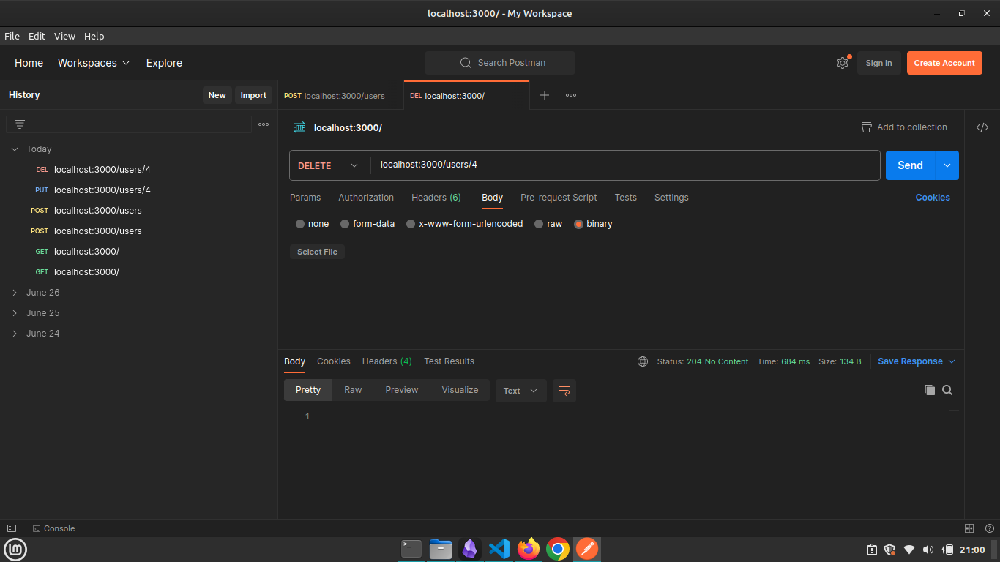

# CRUD APPLICATION Using MySQL & Express.js

### 1. **Set Up The Project**

1. **Create a new directory for project 'CRUD APP 2'**

```bash
cd CRUD\ APP\ 2/
```

2. **Initialize a new Node.js project**

```bash
npm init -y
```

3. **Install the required packages**

```bash
npm install express mysql2 body-parser
```


### 2. **Set Up Your MySQL Database**

1. **Create a MySQL database and table:**

```sql
USE CRUD_APP;

CREATE TABLE users (
 id INT AUTO_INCREMENT PRIMARY KEY,
 name VARCHAR(100) NOT NULL,
 email VARCHAR(100) NOT NULL UNIQUE
);
```


### 3. **Create Your Express.js Application**

1. Create the `routes` Directory

```sh
mkdir routes
```

2. Create the Route Files

- `express`
	- This imports the Express framework, which is used to create web applications and APIs
- `router`
	- This creates a new instance of an Express router, which allows you to define route handlers (endpoints) modularly
- `db`
	- This imports the MySQL database connection from a separate file (`../db`)
	- This file export a MySQL connection object
- `module.exports`
	- This exports the router object


#### routes/getUsers.js

```javascript
const express = require('express');
const router = express.Router();
const db = require('../db'); 

// Read all users
router.get('/', (req, res) => {
  db.query('SELECT * FROM users', (err, results) => {
    if (err) {
      return res.status(500).json({ error: err.message });
    }
    res.json(results);
    console.log(results);
  });
});

module.exports = router;
```

- `router.get('/')`
	- defines a route handler for the HTTP GET request on the root path of this router

- `req`: This is the request object, representing the HTTP request
- `res`: This is the response object, used to send a response back to the client

- `db.query('SELECT * FROM users', (err, results) => {...})`
	- executes a SQL query to select all records from the `users` table in the MySQL database
    - `err`: This is an error object that will be non-null if an error occurs during the query execution
    - `results`: This contains the results of the query, which will be an array of user records

- `if (err) {...}`
	- If there is an error during the query execution, this block sends a 500 Internal Server Error response to the client, with the error message in JSON format

- `res.json(results)`
	- If the query is successful, this sends the query results (i.e., the list of users) back to the client in JSON format

- `console.log(results)`
	- This logs the results of the query to the console for debugging purposes


#### routes/createUser.js

```javascript
const express = require('express');
const router = express.Router();
const db = require('../db');

// Create a new user
router.post('/', (req, res) => {
  const { name, email } = req.body;
  db.query('INSERT INTO users (name, email) VALUES (?, ?)', [name, email], (err, results) => {
    if (err) {
      return res.status(500).json({ error: err.message });
    }
    res.status(201).json({ id: results.insertId, name, email });
  });
});

module.exports = router;
```

- `router.post('/')`
	- This defines a route handler for the HTTP POST request on the root path of this router

- `const { name, email } = req.body;`
	- This line extracts the `name` and `email` properties from the request body
	- The client should send a JSON object containing these fields in the body of the POST request

- `db.query('INSERT INTO users (name, email) VALUES (?, ?)', [name, email], (err, results) => {...})`
	- This executes a SQL query to insert a new record into the `users` table with the provided `name` and `email`
    
- `res.status(201).json({ id: results.insertId, name, email });`
	- If the query is successful, this sends a 201 Created response to the client with a JSON object containing the ID of the newly created user, along with the `name` and `email` provided


#### routes/updateUser.js

```javascript
const express = require('express');
const router = express.Router();
const db = require('../db');

// Update a user
router.put('/:id', (req, res) => {
  const id = req.params.id;
  const { name, email } = req.body;
  db.query('UPDATE users SET name = ?, email = ? WHERE id = ?', [name, email, id], (err, results) => {
    if (err) {
      return res.status(500).json({ error: err.message });
    }
    res.json({ id, name, email });
  });
});

module.exports = router;
```

- `router.put('/:id')`
	- This defines a route handler for the HTTP PUT request on the path `/:id` of this router
	- The `:id` is a route parameter representing the ID of the user to be updated

- `const id = req.params.id;`
	- This line extracts the `id` parameter from the request URL
	- This represents the ID of the user to be updated


#### routes/deleteUser.js

```javascript
const express = require('express');
const router = express.Router();
const db = require('../db');

// Delete a user
router.delete('/:id', (req, res) => {
  const id = req.params.id;
  db.query('DELETE FROM users WHERE id = ?', [id], (err, results) => {
    if (err) {
      return res.status(500).json({ error: err.message });
    }
    res.status(204).send();
  });
});

module.exports = router;
```

- `router.delete('/:id')`
	- This defines a route handler for the HTTP DELETE request on the path `/:id` of this router
	- The `:id` is a route parameter representing the ID of the user to be deleted


3. Create a Separate DB Connection File
#### db.js

```javascript
const mysql = require('mysql2');

// Create MySQL connection
const db = mysql.createConnection({
  host: 'localhost',
  user: 'root',
  password: 'mysql',
  database: 'CRUD_APP'
});

db.connect((err) => {
  if (err) {
    console.error('Error connecting to MySQL:', err);
    return;
  }
  console.log('Connected to MySQL');
});

module.exports = db;
```


4. `app.js` to Import and Use the Route Files
#### app.js

```javascript
const express = require('express');
const bodyParser = require('body-parser');

const getUsersRouter = require('./routes/getUsers');
const createUserRouter = require('./routes/createUser');
const updateUserRouter = require('./routes/updateUser');
const deleteUserRouter = require('./routes/deleteUser');

const app = express();
const port = 3000;

// Middleware
app.use(bodyParser.json());
app.use(bodyParser.urlencoded({ extended: true }));

// Routes
app.use('/', getUsersRouter);
app.use('/users', createUserRouter);
app.use('/users', updateUserRouter);
app.use('/users', deleteUserRouter);

// Start the server
app.listen(port, () => {
  console.log(`Server running at http://localhost:${port}/`);
});
```

- `express`
	- Imports the Express framework, which is used to build the web server and handle HTTP requests and responses.\
- `bodyParser`
	- Imports the `body-parser` middleware, which parses incoming request bodies in a middleware before handling them

- `app.use(bodyParser.json())`
	- Adds middleware to parse JSON request bodies
	- This is essential for handling POST and PUT requests where the request body is JSON
- `app.use(bodyParser.urlencoded({ extended: true }))`
	- Adds middleware to parse URL-encoded request bodies (e.g., form submissions)
	- The `extended: true` option allows for rich objects and arrays to be encoded into the URL-encoded format


### 4. **Run Your Application**

```bash
node app.js
```


### 5. **Test the CRUD operations**

#### 01 POSTMAN to test the CRUD operations





#### 02 `curl` to test the CRUD operations
   
   - **Read all users**
 ```bash
 curl http://localhost:3000/
 ```

   - **Create a new user**
 ```bash
 curl -X POST http://localhost:3000/users -H "Content-Type: application/json" -d '{"name": "Jane Smith", "email": "jane.smith@example.com"}'
 ```


   - **Update a user**
 ```bash
 curl -X PUT http://localhost:3000/users/5 -H "Content-Type: application/json" -d '{"name": "Jane Doe", "email": "jane.doe@example.com"}'
 ```


   - **Delete a user**
 ```bash
 curl -X DELETE http://localhost:3000/users/5
 ```


### 6. **Verify Output**


