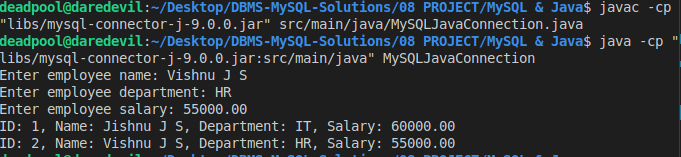
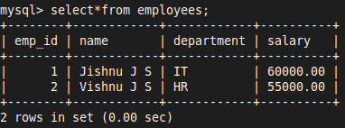

# 22 MySQL & Java

### 1. **Download MySQL Connector/J**
- Download the MySQL JDBC driver (Connector/J) from the [official MySQL website](https://dev.mysql.com/downloads/connector/j/)
- Choose the platform-independent version, which is a ZIP archive
- The JDBC driver allows Java applications to communicate with MySQL databases


### 2. **Extract the JAR File**
- Extract the downloaded ZIP file to get the `mysql-connector-java-9.0.0.jar` file
- This JAR file contains the classes needed to connect to MySQL


### 3. **Set Up Your Java Project**

1. **Create a New Java Project 'MySQL & Java'**
```sh
cd MySQL\ \&\ Java/
code .
```

2. **Initialize the Java Project**
- Create the necessary directory structure and main Java file
```sh
mkdir -p src/main/java
cd src/main/java
touch MySQLJavaConnection.java
```

3. **Add the JAR File to Your Project**
- Create a `libs` directory in your project root.
- Copy the `mysql-connector-j-9.0.0.jar` file to the `libs` folder
- Ensures the JDBC driver is available to your project

```sh
mkdir libs
cp /path/to/mysql-connector-java-8.0.31.jar libs/
```

4. **Configure the Classpath**
- Create a `.classpath` file in your project root directory
- Informs VS Code and the Java compiler where to find the JAR file and your source code

```xml
<?xml version="1.0" encoding="UTF-8"?>
<classpath>
  <classpathentry kind="lib" path="libs/mysql-connector-java-8.0.31.jar"/>
  <classpathentry kind="src" path="src/main/java"/>
  <classpathentry kind="con" path="org.eclipse.jdt.launching.JRE_CONTAINER"/>
</classpath>
```


### 4. **Write Java Code to Connect to MySQL**
- Open `MySQLJavaConnection.java` in `src/main/java` and write the Java code to connect to MySQL, insert data, and retrieve data.

```java
import java.sql.Connection;
import java.sql.DriverManager;
import java.sql.PreparedStatement;
import java.sql.ResultSet;
import java.sql.SQLException;
import java.util.Scanner;

public class MySQLJavaConnection {
    public static void main(String[] args) {
        String url = "jdbc:mysql://localhost:3306/DEMO";
        String user = "root";
        String password = "mysql";

        Scanner scanner = new Scanner(System.in);

        System.out.print("Enter employee name: ");
        String name = scanner.nextLine();

        System.out.print("Enter employee department: ");
        String department = scanner.nextLine();

        System.out.print("Enter employee salary: ");
        double salary = scanner.nextDouble();

        Connection connection = null;
        PreparedStatement preparedStatement = null;
        ResultSet resultSet = null;

        try {
            // Load the JDBC driver
            Class.forName("com.mysql.cj.jdbc.Driver");

            // Establish the connection
            connection = DriverManager.getConnection(url, user, password);

            // Insert data into the table
            String insertQuery = "INSERT INTO employees (name, department, salary) VALUES (?, ?, ?)";
            preparedStatement = connection.prepareStatement(insertQuery);
            preparedStatement.setString(1, name);
            preparedStatement.setString(2, department);
            preparedStatement.setDouble(3, salary);
            preparedStatement.executeUpdate();

            // Retrieve and print data from the table
            String selectQuery = "SELECT * FROM employees";
            preparedStatement = connection.prepareStatement(selectQuery);
            resultSet = preparedStatement.executeQuery();

            while (resultSet.next()) {
                int empId = resultSet.getInt("emp_id");
                String empName = resultSet.getString("name");
                String empDepartment = resultSet.getString("department");
                double empSalary = resultSet.getDouble("salary");

                System.out.printf("ID: %d, Name: %s, Department: %s, Salary: %.2f%n", empId, empName, empDepartment, empSalary);
            }

        } catch (ClassNotFoundException e) {
            System.err.println("JDBC Driver not found.");
            e.printStackTrace();
        } catch (SQLException e) {
            System.err.println("Database connection error.");
            e.printStackTrace();
        } finally {
            // Close the ResultSet, PreparedStatement, and Connection
            try {
                if (resultSet != null) resultSet.close();
                if (preparedStatement != null) preparedStatement.close();
                if (connection != null) connection.close();
            } catch (SQLException e) {
                e.printStackTrace();
            }
        }

        scanner.close();
    }
}
```


### 5. **Compile and Run Your Java Program**
- Open a terminal in project root directory and compile & run the Java program

```sh
javac -cp ".:libs/mysql-connector-java-8.0.31.jar" src/main/java/MySQLJavaConnection.java
```

```sh
java -cp ".:libs/mysql-connector-java-8.0.31.jar:src/main/java" MySQLJavaConnection
```


### 6. **Output**




