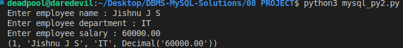
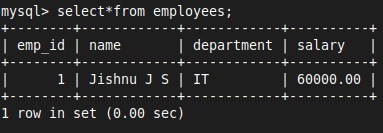

# 21 MySQL & Python

```sql
USE DEMO;

CREATE TABLE employees (
    emp_id INT AUTO_INCREMENT PRIMARY KEY,
    name VARCHAR(100),
    department VARCHAR(50),
    salary DECIMAL(10, 2)
);
```

# MySQL & pymysql
- To connect MySQL with Python, we can use library `PyMySQL` 

1. **Install the `PyMySQL`**

```bash
pip install pymysql
```

2. **Import the `PyMySQL` in Your Python Script**

```python
import pymysql
```

3. **Establish a Connection to the MySQL Database**
	- Use the `connect` method of `pymysql` to connect to your MySQL server

   ```python
   connection = pymysql.connect(
       host="localhost",           # e.g., "localhost" or IP address
       user="root",                # MySQL username
       password="mysql",           # MySQL password
       database="DEMO"             # the database you want to use
   )
   ```

4. **Create a Cursor Object**
	- The cursor is used to execute SQL queries

```python
cursor = connection.cursor()
```

5. **Execute SQL Queries**
	- You can use the cursor to execute SQL commands

```python
cursor.execute("SELECT * FROM employees")
results = cursor.fetchall()

for row in results:
   print(row)
```

   - For inserting data

   ```python
   cursor.execute("INSERT INTO employees (name, department, salary) VALUES (%s, %s, %s)", ('New Employee', 'IT', 60000))
   connection.commit()  
   ```

6. **Close the Connection**

   ```python
   cursor.close()
   connection.close()
   ```

7. `pymsql` code
```python
import pymysql

# Establish the connection
connection = pymysql.connect(
    host="localhost",
    user="root",
    password="mysql",
    database="DEMO"
)

# Create a cursor object
cursor = connection.cursor()

# Insert data into the table
name = str(input('Enter employee name : '))
department = str(input('Enter employee department : '))
salary = float(input('Enter employee salary : '))

# MySQL uses %s for all types of data, and PyMySQL handles the conversion internally
cursor.execute("INSERT INTO employees (name, department, salary) VALUES (%s, %s, %s)", (name, department, salary))

# Commit the changes
connection.commit()  

# Retrieve and print data from the table
cursor.execute("SELECT * FROM employees")
results = cursor.fetchall()
for row in results:
    print(row)

# Close the cursor and connection
cursor.close()
connection.close()
```



8. **Verify the results**

```sql
SELECT * FROM employees;
```




# MySQL & mysql-connector-python
- To connect MySQL with Python, we can also use library `mysql-connector-python` 

```bash
pip install mysql-connector-python
```

- Here's a complete example

```python
import mysql.connector

# Establish the connection
conn = mysql.connector.connect(
    host="localhost",
    user="root",
    password="mysql",
    database="DEMO"
)

# Create a cursor object
cursor = conn.cursor()

# Insert data into the table
cursor.execute("INSERT INTO employees (name, department, salary) VALUES (%s, %s, %s)", ('John Doe', 'HR', 55000))
conn.commit()  # Commit the changes

# Retrieve and print data from the table
cursor.execute("SELECT * FROM employees")
results = cursor.fetchall()
for row in results:
    print(row)

# Close the cursor and connection
cursor.close()
conn.close()
```
