# CASE STUDY - LIBRARY 02

# SQL - DML & DQL

### 1. INSERT
- Insert Values to the LANGUAGE Table

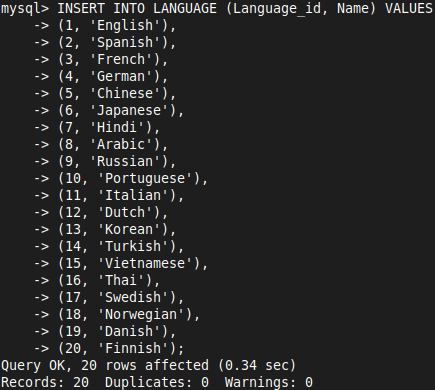

### 2. UPDATE
- **Modify status from 'Active' to 'Inactive' on MEMBER where id=11**

```SQL
UPDATE MEMBER SET Status='Inactive' WHERE Member_id=11;
```

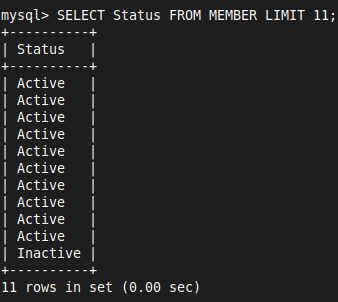

- **Modify the MRP of all books published by 'Oxford University Press', provide 10% discount on MRP**

```SQL
UPDATE BOOK, PUBLISHER SET BOOK.MRP = 0.1*BOOK.MRP 
WHERE BOOK.Publisher_id = PUBLISHER.Publisher_id AND PUBLISHER.Name LIKE 'Oxford%';
```

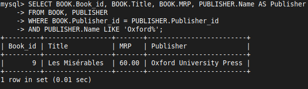

- **Modify the Status from 'Issued' to 'Not Returned' on id 5 to 10 in BOOK_ISSUE**

```SQL
UPDATE BOOK_ISSUE SET Status='Not Returned' WHERE Issue_id BETWEEN 5 AND 10;
```

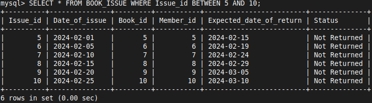

### 3. Delete 
- Delete existing records from a table

```SQL
DELETE FROM table_name;
```

```SQL
DELETE FROM table_name WHERE condition;
```

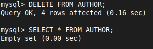

### 4. SELECT

- Find all books where title starts with 'T'

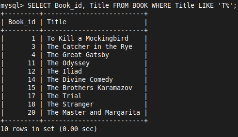


- Find all books published between Jan 1st 1950 and Dec 31st 1960

```SQL
SELECT Book_id, Title, Published_date 
FROM BOOK 
WHERE Published_date BETWEEN '1950-01-01' AND '1960-12-31'
```

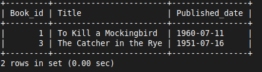


- Find all books published by 'Penguin Random House' having MRP less than 500

```SQL
SELECT BOOK.Title, PUBLISHER.Name, BOOK.MRP 
FROM BOOK JOIN PUBLISHER 
ON PUBLISHER.Publisher_id = BOOK.Publisher_id 
WHERE PUBLISHER.Name LIKE 'Penguin%' AND BOOK.MRP < 500;
```

```SQL
SELECT BOOK.Title, PUBLISHER.Name, BOOK.MRP 
FROM BOOK, PUBLISHER 
WHERE PUBLISHER.Name LIKE 'Penguin%' 
AND BOOK.MRP < 500 
AND PUBLISHER.Publisher_id = BOOK.Publisher_id;
```

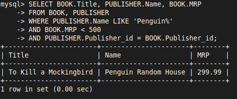


- Find publisher who are from 'New York, USA' and 'London, UK'

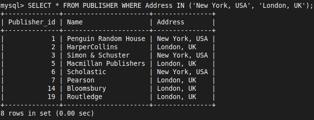


 - Get the no of books written by author named 'Fyodor Dostoevsky'

```SQL
SELECT COUNT(*) AS 'No of Books' 
FROM BOOK_AUTHOR, AUTHOR 
WHERE AUTHOR.Name = 'Fyodor Dostoevsky'
AND AUTHOR.Author_id = BOOK_AUTHOR.Author_id;
```

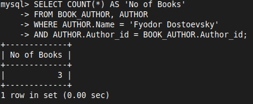


- Get the list of publishers and the no of books published by each publisher

```SQL
SELECT PUBLISHER.Name, COUNT(*) AS 'No of Books' 
FROM BOOK, PUBLISHER
WHERE PUBLISHER.Publisher_id = BOOK.Publisher_id 
GROUP BY PUBLISHER.Name;
```

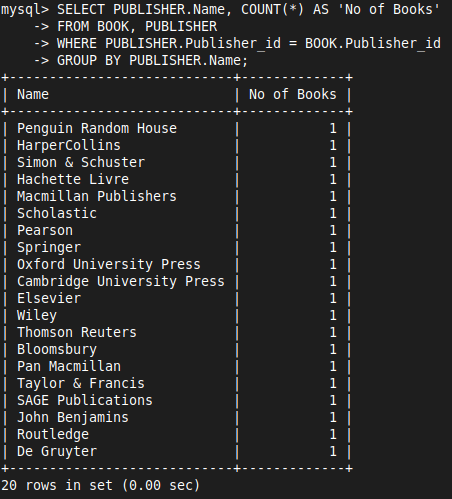


- Get the list of books that are not returned

```SQL
SELECT BOOK.Title AS 'Books Issued but Not Returned' FROM BOOK, BOOK_ISSUE 
WHERE BOOK.Book_id = BOOK_ISSUE.Book_id AND BOOK_ISSUE.Status = 'Not Returned';
```

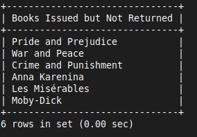

- Get the list of the students who reads only 'English' books

```SQL
SELECT A.Name, B.Book_id 
FROM MEMBER A, BOOK B, BOOK_ISSUE C, LANGUAGE D 
WHERE D.Name = 'English' 
AND D.Language_id = B.Language_id 
AND B.Book_id = C.Book_id 
AND A.Member_id = C.Member_id;
```

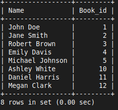

- Get the total fine collected on 'March' 

```SQL
SELECT SUM(Late_fee) AS 'Fine Collected on March' 
FROM BOOK_RETURN WHERE Actual_date_of_return > '2024-02-29' 
AND Actual_date_of_return < '2024-04-01';
```

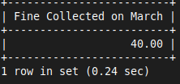

- Get the list of students who have overdue (not returned the book even after due date)

```SQL
SELECT Name, Branch_code, Phone FROM MEMBER, BOOK_ISSUE 
WHERE MEMBER.Member_id = BOOK_ISSUE.Member_id 
AND BOOK_ISSUE.Status = 'Not Returned';
```

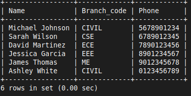

