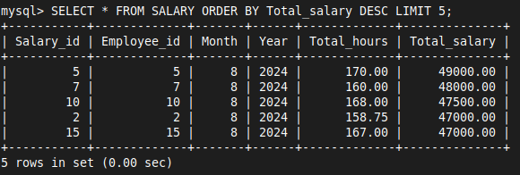

# CASE STUDY - OFFICE 02

- **Select all employees who joined after 2024-01-01**
```sql
SELECT * FROM EMPLOYEE WHERE Date_of_joining > '2024-01-01';
```


- **Find all distinct departments**
```sql
SELECT DISTINCT Department_id FROM EMPLOYEE;
```


- **Calculate the average salary of employees in each department**
```sql
SELECT Department_id, AVG(Total_salary) AS Avg_Salary 
FROM SALARY 
JOIN EMPLOYEE ON SALARY.Employee_id = EMPLOYEE.Employee_id 
GROUP BY Department_id;
```

```sql
SELECT EMPLOYEE.Department_id, DEPARTMENT.Name AS Department_Name, AVG(SALARY.Total_salary) AS Avg_Salary
FROM EMPLOYEE, DEPARTMENT, SALARY
WHERE EMPLOYEE.Department_id = DEPARTMENT.Department_id
AND EMPLOYEE.Employee_id = SALARY.Employee_id
GROUP BY EMPLOYEE.Department_id;
```


- **Count the number of employees in each department**
```sql
SELECT Department_id, COUNT(*) AS Employee_Count 
FROM EMPLOYEE 
GROUP BY Department_id;
```


- **List employees who worked more than 160 hours in a month**
```sql
SELECT EMPLOYEE.Name, EMPLOYEE.Department_id, SALARY.Total_hours 
FROM EMPLOYEE, SALARY 
WHERE EMPLOYEE.Employee_id = SALARY.Employee_id 
AND SALARY.Total_hours > 160;
```

```SQL
SELECT EMPLOYEE.Name, EMPLOYEE.Department_id, SALARY.Total_hours
FROM EMPLOYEE
JOIN SALARY ON EMPLOYEE.Employee_id = SALARY.Employee_id
WHERE SALARY.Total_hours > 160;
```


- **Find employees with a salary greater than 45000**
```sql
SELECT EMPLOYEE.Name, EMPLOYEE.Department_id, SALARY.Total_salary \FROM EMPLOYEE, SALARY 
WHERE EMPLOYEE.Employee_id = SALARY.Employee_id 
AND SALARY.Total_salary > 45000;
```


- **Retrieve the employee details along with their department name**
```sql
SELECT E.Employee_id, E.Name, D.Name AS Department_Name 
FROM EMPLOYEE E 
JOIN DEPARTMENT D ON E.Department_id = D.Department_id;
```

```sql
SELECT E.Employee_id, E.Name, D.Name AS Department_Name 
FROM EMPLOYEE E, DEPARTMENT D 
WHERE E.Department_id = D.Department_id;
```


- **Get the total salary paid to employees in each month**
```sql
SELECT Month, Year, SUM(Total_salary) AS Total_Salary 
FROM SALARY 
GROUP BY Month, Year;
```


- **Find employees who are working on more than 2 projects**
```sql
SELECT Employee_id, COUNT(Project_id) AS Project_Count 
FROM EMPLOYEE_PROJECT 
GROUP BY Employee_id 
HAVING COUNT(Project_id) > 2;
```


- **List all projects and the number of employees working on each project**
```sql
SELECT Project_id, COUNT(Employee_id) AS Employee_Count 
FROM EMPLOYEE_PROJECT 
GROUP BY Project_id;
```


- **Get the maximum and minimum salary in the company**
```sql
SELECT MAX(Total_salary) AS Max_Salary, MIN(Total_salary) AS Min_Salary FROM SALARY;
```


- **Retrieve the top 5 highest-paid employees**
```sql
SELECT * FROM SALARY ORDER BY Total_salary DESC LIMIT 5;
```




- **Find the total number of hours worked by each employee**
```sql
SELECT Employee_id, SUM(Total_hours) AS Total_Hours 
FROM SALARY 
GROUP BY Employee_id;
```


- **Find all employees whose name starts with 'A'**
```sql
SELECT * FROM EMPLOYEE WHERE Name LIKE 'A%';
```


- **Calculate the average number of hours worked by employees in each department**
```sql
SELECT E.Department_id, AVG(S.Total_hours) AS Avg_Hours 
FROM SALARY S 
JOIN EMPLOYEE E ON S.Employee_id = E.Employee_id 
GROUP BY E.Department_id;
```

```SQL
SELECT E.Department_id, AVG(S.Total_hours) AS Avg_hours
FROM EMPLOYEE E, SALARY S
WHERE E.Employee_id = S.Employee_id
GROUP BY E.Department_id;
```


- **Find the employee who has worked the most hours in a single month**
```sql
SELECT E.Name, S.Total_hours 
FROM EMPLOYEE E, SALARY S 
WHERE E.Employee_id = S.Employee_id 
ORDER BY S.Total_hours DESC LIMIT 1;
```


- **List all departments that have more than 5 employees**
```sql
SELECT Department_id, COUNT(*) AS Employee_Count 
FROM EMPLOYEE 
GROUP BY Department_id 
HAVING COUNT(*) > 5;
```


- **Find the total salary paid to each employee**
```sql
SELECT Employee_id, SUM(Total_salary) AS Total_Salary 
FROM SALARY 
GROUP BY Employee_id;
```


- **Retrieve the employee details along with the total number of projects they are working on**
```sql
SELECT E.Employee_id, E.Name, COUNT(EP.Project_id) AS Project_Count 
FROM EMPLOYEE E 
LEFT JOIN EMPLOYEE_PROJECT EP ON E.Employee_id = EP.Employee_id 
GROUP BY E.Employee_id, E.Name;
```


- **Get the total number of hours worked by employees in each project**
```sql
SELECT EP.Project_id, SUM(S.Total_hours) AS Total_Hours 
FROM EMPLOYEE_PROJECT EP 
JOIN SALARY S ON EP.Employee_id = S.Employee_id 
GROUP BY EP.Project_id;
```


- **Find all employees who have not worked on any project**
```sql
SELECT * FROM EMPLOYEE WHERE Employee_id NOT IN (SELECT DISTINCT Employee_id FROM EMPLOYEE_PROJECT);
```


- **Calculate the total salary paid to employees in each department**
```sql
SELECT E.Department_id, SUM(S.Total_salary) AS Total_Salary 
FROM SALARY S 
JOIN EMPLOYEE E ON S.Employee_id = E.Employee_id 
GROUP BY E.Department_id;
```


- **List employees along with their total hours worked in each month**
```sql
SELECT E.Employee_id, E.Name, S.Month, S.Year, SUM(S.Total_hours) AS Total_Hours 
FROM EMPLOYEE E 
JOIN SALARY S ON E.Employee_id = S.Employee_id 
GROUP BY E.Employee_id, E.Name, S.Month, S.Year;
```


- **Retrieve employees who joined between January and March 2024**
```sql
SELECT * FROM EMPLOYEE WHERE Date_of_joining BETWEEN '2024-01-01' AND '2024-03-31';
```


- **List all employees and their respective department names**
```sql
SELECT E.Name, D.Name AS Department_Name 
FROM EMPLOYEE E 
JOIN DEPARTMENT D ON E.Department_id = D.Department_id;
```


- **Get the total number of employees in each project**
```sql
SELECT P.Project_id, COUNT(EP.Employee_id) AS Employee_Count 
FROM PROJECT P 
LEFT JOIN EMPLOYEE_PROJECT EP ON P.Project_id = EP.Project_id 
GROUP BY P.Project_id;
```


- **Find the total salary of employees who worked on project 1**
```sql
SELECT SUM(S.Total_salary) AS Total_Salary 
FROM SALARY S 
JOIN EMPLOYEE_PROJECT EP ON S.Employee_id = EP.Employee_id 
WHERE EP.Project_id = 1;
```


- **Find the employee who has worked the least hours in a single month**
```sql
SELECT E.Name, S.Total_hours 
FROM EMPLOYEE E, SALARY S
WHERE E.Employee_id = S.Employee_id
ORDER BY S.Total_hours ASC LIMIT 1;
```


- **Retrieve the list of all employees, their department, and the total salary they earned**
```sql
SELECT E.Employee_id, E.Name, D.Name AS Department_Name, SUM(S.Total_salary) AS Total_Salary 
FROM EMPLOYEE E 
JOIN DEPARTMENT D ON E.Department_id = D.Department_id 
JOIN SALARY S ON E.Employee_id = S.Employee_id 
GROUP BY E.Employee_id, E.Name, D.Name;
```


- **Find employees who worked on both project 1 and project 2**
```sql
SELECT Employee_id 
FROM EMPLOYEE_PROJECT 
WHERE Project_id IN (1, 2) 
GROUP BY Employee_id 
HAVING COUNT(DISTINCT Project_id) = 2;
```


- **Calculate the average number of hours worked by employees in August 2024**
```sql
SELECT AVG(Total_hours) AS Avg_Hours 
FROM SALARY 
WHERE Month = 8 AND Year = 2024;
```


- **Find employees who earned the same salary in two different months**
```sql
SELECT Employee_id, Total_salary 
FROM SALARY 
GROUP BY Employee_id, Total_salary 
HAVING COUNT(*) > 1;
```


- **List all projects and the total salary paid to employees working on each project**
```sql
SELECT EP.Project_id, SUM(S.Total_salary) AS Total_Salary 
FROM EMPLOYEE_PROJECT EP 
JOIN SALARY S ON EP.Employee_id = S.Employee_id 
GROUP BY EP.Project_id;
```


- **Get the employee details with the highest total salary over all months**
```sql
SELECT E.Employee_id, E.Name, SUM(S.Total_salary) AS Total_Salary 
FROM EMPLOYEE E 
JOIN SALARY S ON E.Employee_id = S.Employee_id 
GROUP BY E.Employee_id, E.Name 
ORDER BY SUM(S.Total_salary) DESC LIMIT 1;
```

