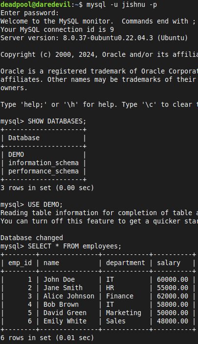
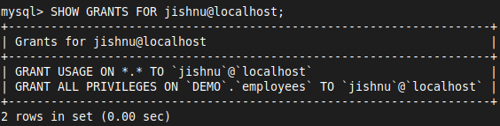
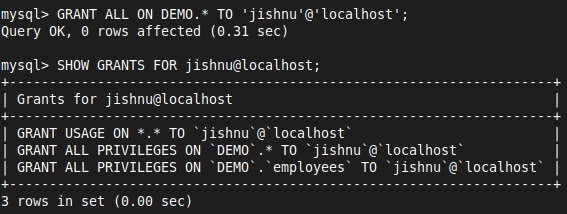
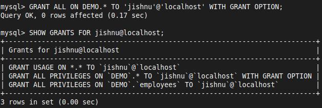
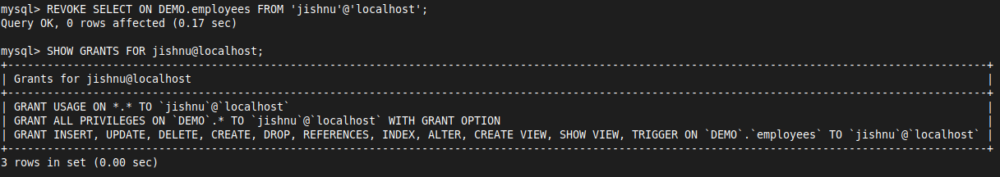
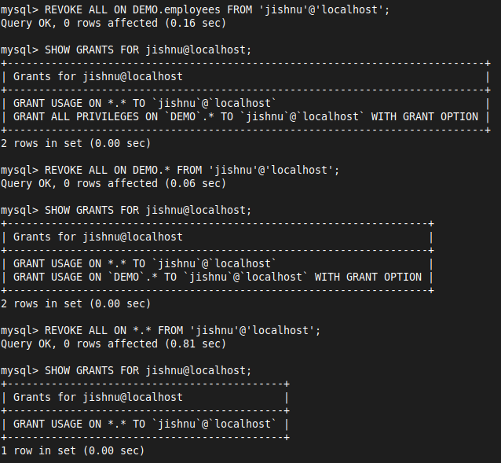

# 13 SQL - DCL

## **Data Control Language (DCL)** 
- DCL is a subset of SQL used to control access to data in a database
- DCL commands are primarily used to grant and revoke privileges on database objects like tables, views, and procedures

### **DCL Commands**
1. **GRANT**: Gives specific privileges to users or roles
2. **REVOKE**: Removes previously granted privileges from users or roles


- Given the `DEMO` database and the `employees` table
#### **Step 1: Create a New User**

```sql
CREATE USER 'jishnu'@'localhost' IDENTIFIED BY 'jishnusmysql';
```

#### **Step 2: Grant Privileges**
- Let's grant `jishnu` permission to view the data in the `employees` table

```sql
GRANT SELECT ON DEMO.employees TO 'jishnu'@'localhost';
```

- Now, `jishnu` can execute the following command to view the data

```sql
SELECT * FROM DEMO.employees;
```



- Grant `jishnu` all permissions on `employees` table

```sql
GRANT ALL ON DEMO.employees TO 'jishnu'@'localhost';
```

- View all permissions for `jishnu`

```sql
SHOW GRANTS FOR jishnu@localhost;
```



 - Grant `jishnu` all permissions on `DEMO` database

```SQL
GRANT ALL ON DEMO.* TO 'jishnu'@'localhost';
```



- If you want `jishnu` to be able to grant privileges to other users, you can add the `GRANT OPTION`

```sql
GRANT ALL ON DEMO.* TO 'jishnu'@'localhost' WITH GRANT OPTION;
```



- Grant all permissions to `jishnu`

```sql
GRANT ALL ON *.* TO 'jishnu'@'localhost';
```

- Refresh Privileges : After granting privileges, it's a good practice to refresh the privileges to ensure they take effect

```SQL
FLUSH PRIVILEGES;
```

#### **Step 3: Revoke Privileges**

```sql
REVOKE SELECT ON DEMO.employees FROM 'jishnu'@'localhost';
```



```sql
REVOKE ALL ON DEMO.employees FROM 'jishnu'@'localhost';
```

```sql
REVOKE ALL ON DEMO.* FROM 'jishnu'@'localhost';
```

```sql
REVOKE ALL ON *.* FROM 'jishnu'@'localhost';
```



#### **Step 4: Drop User**

```sql
DROP USER 'jishnu'@'localhost';
```