# 15 PL-SQL

- PL/SQL (Procedural Language/Structured Query Language) is an extension of SQL used in Oracle databases
- It combines the power of SQL with procedural features like loops, conditions, and variables, allowing for more complex and powerful database operations

### Key Features of PL/SQL
1. **Tight Integration with SQL**
	-  PL/SQL is designed to work seamlessly with SQL, making it easy to embed SQL statements within a PL/SQL block
2. **Procedural Constructs**
	-  PL/SQL supports procedural constructs like loops, conditional statements (IF-THEN-ELSE), and exception handling, enabling more complex logic in database operations
3. **Block Structure**
	-  PL/SQL code is organized into blocks, which can be anonymous or named
	- Each block typically has three sections: **declaration**, **execution**, and **exception handling**
4. **Error Handling**
	-  PL/SQL has robust error-handling capabilities through exception handling blocks
5. **Portability**
	-  PL/SQL code is portable across different Oracle databases

### Structure of a PL/SQL Block
1. **Declaration Section** (Optional):
    - This is where variables, constants, cursors, and other PL/SQL objects are declared
2. **Execution Section** (Mandatory):
    - This is where the main logic is implemented
    - SQL queries and procedural statements are executed here
3. **Exception Section** (Optional)
    - This section handles errors that occur during the execution
    - It's useful for managing runtime errors


- PL/SQL is specific to Oracle databases, but you can use similar concepts in MySQL with its own procedural extensions like **MySQL Stored Procedures and Functions**

# 01 Procedure
- A procedure in MySQL is a stored program that you can call to perform a specific task
- It consists of a sequence of SQL statements and procedural code, encapsulated for reuse and modular programming
- Procedures can take input parameters, perform operations, and return results

### Components of a MySQL Procedure
1. **Name**: The name of the procedure
2. **Parameters**: Procedures can have input (`IN`), output (`OUT`), or input-output (`INOUT`) parameters
3. **Body**: The procedural code enclosed in a `BEGIN ... END` block
4. **Error Handling**: Optional error-handling mechanisms using handlers
5.  **DELIMITER**: Changes the statement delimiter to `//` to allow semicolons (`;`) within the procedure body without ending the statement prematurely

### Syntax
```sql
DELIMITER //

CREATE PROCEDURE procedure_name ([IN|OUT|INOUT] parameter_name datatype, ...)
BEGIN
    -- Procedural code goes here
END //

DELIMITER ;
```

### 1. Simple Procedure
- This example creates a procedure that calculates the sum of two numbers

```sql
DELIMITER //

CREATE PROCEDURE add_numbers(IN num1 INT, IN num2 INT, OUT sum INT)
BEGIN
    SET sum = num1 + num2;
END //

DELIMITER ;
```

- To call this procedure and see the result:

```sql
CALL add_numbers(10, 20, @result);
SELECT @result AS sum;
```

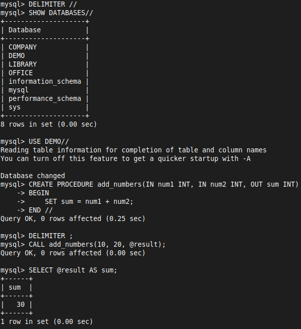

- In MySQL, the `DEFINER` clause is used to specify the security context in which a stored procedure, function, or trigger executes
- By default, it is set to the user who creates the object
- However, you can explicitly set it to a different user

```sql
DELIMITER //

CREATE DEFINER='root'@'localhost' PROCEDURE addnum(IN num1 INT, IN num2 INT)
BEGIN
    DECLARE sum INT;
    SET sum = num1 + num2;
    SELECT sum;
END //

DELIMITER ;
```

```sql
CALL addnum(5, 10);
```

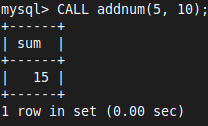

### 2. Procedure with a Query
- This example creates a procedure that retrieves the name of an employee based on their `emp_id` from  `DEMO` database `employees` table

```sql
DELIMITER //

CREATE PROCEDURE get_employee_name(IN id INT, OUT emp_name VARCHAR(100))
BEGIN
    SELECT name INTO emp_name
    FROM employees
    WHERE emp_id = id;
END //

DELIMITER ;
```

```sql
CALL get_employee_name(1, @name);
SELECT @name AS employee_name;
```

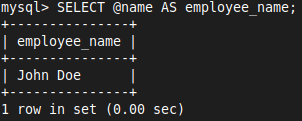

### 3. Procedure with Conditional Logic
- This example creates a procedure that updates an employee's salary and checks if the update was successful

```sql
DELIMITER //

CREATE PROCEDURE update_employee_salary(IN id INT, IN new_salary DECIMAL(10, 2))
BEGIN
    UPDATE employees
    SET salary = new_salary
    WHERE emp_id = id;

    IF ROW_COUNT() > 0 THEN
        SELECT 'Salary updated successfully' AS result;
    ELSE
        SELECT 'No employee found with the given ID' AS result;
    END IF;
END //

DELIMITER ;
```

```sql
CALL update_employee_salary(1, 65000.00);
```

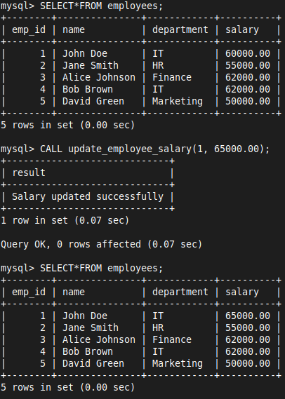

```sql
DELIMITER //

CREATE PROCEDURE check_salary(IN emp_id INT,IN threshold DECIMAL(10, 2), OUT result VARCHAR(100))
BEGIN
    DECLARE current_salary DECIMAL(10, 2);
    
    SELECT salary INTO current_salary
    FROM employees
    WHERE employees.emp_id = emp_id;
    
    IF current_salary > threshold THEN
        SET result = 'High salary band';
    ELSEIF current_salary = threshold THEN
        SET result = 'Correct salary band';
    ELSE
        SET result = 'Low salary band';
    END IF;
END //

DELIMITER ;
```

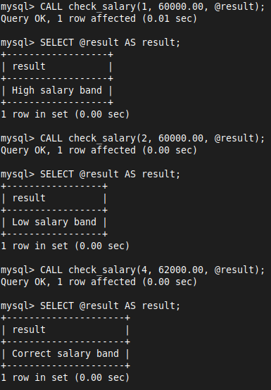

```sql
DELIMITER //

CREATE PROCEDURE get_department_name(IN dept_id INT)
BEGIN
	DECLARE dept_name VARCHAR(100);
    CASE dept_id
        WHEN 1 THEN SET dept_name = 'IT';
        WHEN 2 THEN SET dept_name = 'HR';
        WHEN 3 THEN SET dept_name = 'Finance';
        WHEN 4 THEN SET dept_name = 'Marketing';
        WHEN 5 THEN SET dept_name = 'Sales';
        ELSE SET dept_name = 'Unknown';
    END CASE;
    SELECT dept_name;
END //

DELIMITER ;
```

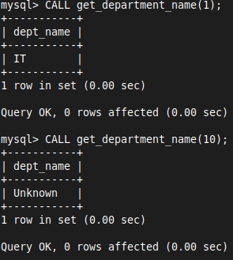

```sql
DELIMITER //

CREATE PROCEDURE calculate_factorial(IN num INT, OUT factorial BIGINT)
BEGIN
    DECLARE i INT DEFAULT 1;
    SET factorial = 1;
    
    WHILE i <= num DO
        SET factorial = factorial * i;
        SET i = i + 1;
    END WHILE;
END //

DELIMITER ;
```

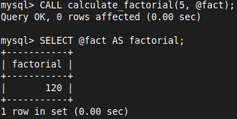

### 4. Error Handling in Procedures
- You can handle errors in MySQL procedures using `DECLARE ... HANDLER` statements

```sql
DELIMITER //

CREATE PROCEDURE division_example(IN num1 INT, IN num2 INT, OUT result DECIMAL(10, 2))
BEGIN
    DECLARE CONTINUE HANDLER FOR SQLEXCEPTION
    BEGIN
        SET result = NULL;
        SELECT 'Error: Division by zero or another SQL error' AS error_message;
    END;

    SET result = num1 / num2;
END //

DELIMITER ;
```

```sql
CALL division_example(10, 0, @output);
SELECT @output AS result;
```

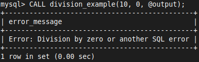

### Managing Procedures

- **Show procedures**: List all procedures in the current database
  ```sql
  SHOW PROCEDURE STATUS WHERE Db = 'database_name';
  ```

- **Show procedure code**: View the definition of a specific procedure
  ```sql
  SHOW CREATE PROCEDURE procedure_name;
  ```

- **Drop a procedure**: Remove a procedure from the database
  ```sql
  DROP PROCEDURE procedure_name;
  ```


# 02 Function
- Functions in MySQL are similar to stored procedures but are used to return a single value and can be used in SQL statements like SELECT, INSERT, etc
### Syntax
```sql
CREATE [DEFINER = { user | CURRENT_USER }] FUNCTION function_name (parameter_name datatype, ...)
RETURNS return_datatype
[characteristic ...]
BEGIN
    -- Function body
    RETURN value;
END
```

- `DETERMINISTIC`: Indicates that the function always produces the same result for the same input parameters
- `NO SQL`: Indicates that the function does not contain SQL statements
- `READS SQL DATA`: Indicates that the function contains SQL statements, but does not modify data (only reads data)

### 1. Simple Function

```sql
DELIMITER //

CREATE FUNCTION add_numbers(num1 INT, num2 INT) RETURNS INT
DETERMINISTIC
BEGIN
    RETURN num1 + num2;
END //

DELIMITER ;

```

```sql
SELECT add_numbers(10, 20) AS result;
```

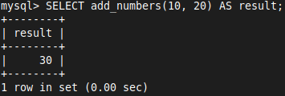

- The `DEFINER` clause specifies the MySQL user account under which the stored function or procedure runs.
- It is not strictly necessary unless you want the function or procedure to execute with specific user privileges
- By default, the function or procedure will run with the privileges of the user who is invoking it

```sql
DELIMITER //

CREATE DEFINER='root'@'localhost' FUNCTION addnum(num1 INT, num2 INT) RETURNS INT DETERMINISTIC
BEGIN
    RETURN num1 + num2;
END //

DELIMITER ;
```

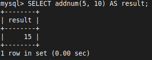

### 2. Procedure with Conditional Logic

```sql
DELIMITER //

CREATE FUNCTION check_salary(id INT, threshold DECIMAL(10, 2)) RETURNS VARCHAR(100) DETERMINISTIC
BEGIN
    DECLARE current_salary DECIMAL(10, 2);
    DECLARE result VARCHAR(100);

    SELECT salary INTO current_salary
    FROM employees
    WHERE emp_id = id;

    IF current_salary > threshold THEN
        SET result = 'High salary band';
    ELSEIF current_salary = threshold THEN
        SET result = 'Correct salary band';
    ELSE
        SET result = 'Low salary band';
    END IF;

    RETURN result;
END //

DELIMITER ;
```

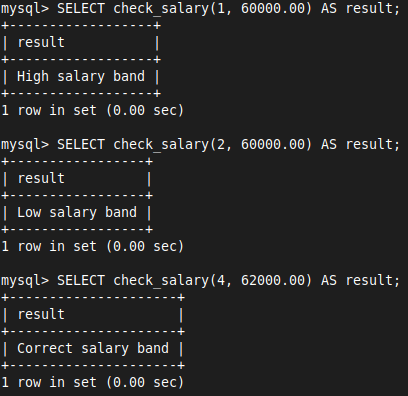

```sql
DELIMITER //

CREATE FUNCTION get_department_name(dept_id INT) RETURNS VARCHAR(100) DETERMINISTIC
BEGIN
    CASE dept_id
        WHEN 1 THEN RETURN 'IT';
        WHEN 2 THEN RETURN 'HR';
        WHEN 3 THEN RETURN 'Finance';
        WHEN 4 THEN RETURN 'Marketing';
        WHEN 5 THEN RETURN 'Sales';
        ELSE RETURN 'Unknown';
    END CASE;
END //

DELIMITER ;
```

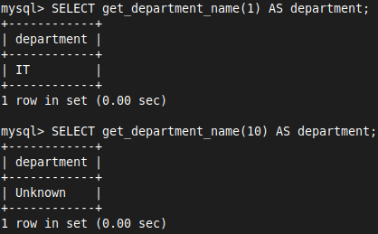


```sql
DELIMITER //

CREATE FUNCTION factorial(num INT) RETURNS BIGINT DETERMINISTIC
BEGIN
    DECLARE i INT DEFAULT 1;
    DECLARE result BIGINT DEFAULT 1;

    WHILE i <= num DO
        SET result = result * i;
        SET i = i + 1;
    END WHILE;
    
    RETURN result;
END //

DELIMITER ;
```

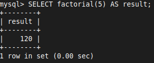

### Using Functions in SQL Statements

You can use functions in various SQL statements. For example:

```sql
SELECT name, salary_band(salary) AS salary_category
FROM employees;

INSERT INTO log (description)
VALUES (get_department_name(1));

UPDATE employees
SET salary = salary + add_numbers(1000, 2000)
WHERE emp_id = 1;
```

### Managing Functions
#### Show Functions
```sql
SHOW FUNCTION STATUS WHERE Db = 'database_name';
```
#### Show Function Code
```sql
SHOW CREATE FUNCTION function_name;
```
#### Drop a Function
```sql
DROP FUNCTION function_name;
```


