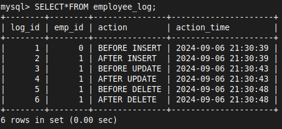

# 16 PL-SQL - Trigger

- Triggers in PL/SQL are stored procedures that are automatically executed (or "triggered") in response to certain events on a particular table or view
- These events could be insertions, updates, or deletions
- Triggers can be used to enforce business rules, validate input data, update other tables, and maintain complex integrity constraints

### Basic Syntax of Creating a Trigger
```sql
CREATE TRIGGER trigger_name
{BEFORE | AFTER} {INSERT | UPDATE | DELETE}
ON table_name
FOR EACH ROW
BEGIN
    -- trigger body: SQL statements
END;
```

- **`BEFORE` or `AFTER`**: Specifies when the trigger should be executed
- **`INSERT`, `UPDATE`, or `DELETE`**: Specifies the event that causes the trigger to execute
- **`table_name`**: Name of the table on which the trigger is set
- **`FOR EACH ROW`**: The trigger is activated for each row affected by the event
- **`BEGIN ... END;`**: The trigger body containing the SQL statements to be executed


```sql
DELETE FROM employees;

ALTER TABLE employees
MODIFY COLUMN emp_id INT AUTO_INCREMENT;

```

- Now, the `employees` table structure:
```sql
CREATE TABLE employees (
    emp_id INT AUTO_INCREMENT PRIMARY KEY,
    name VARCHAR(100),
    department VARCHAR(50),
    salary DECIMAL(10, 2)
);
```

- Create the `employee_log` table to store log entries:

```sql
CREATE TABLE employee_log (
    log_id INT AUTO_INCREMENT PRIMARY KEY,
    emp_id INT,
    action VARCHAR(50),
    action_time DATETIME
);
```

## 1. Trigger for Insert

### BEFORE INSERT Trigger
- This trigger logs an entry before a new employee is inserted

```sql
DELIMITER //

CREATE TRIGGER before_employee_insert
BEFORE INSERT ON employees
FOR EACH ROW
BEGIN
    INSERT INTO employee_log (emp_id, action, action_time)
    VALUES (NEW.emp_id, 'BEFORE INSERT', NOW());
END //

DELIMITER ;
```

- **BEFORE INSERT:** Specifies that the trigger will activate before an `INSERT` operation is performed on the `employees` table
- **NOW():** A function that returns the current date and time, logging when the action occurred

### AFTER INSERT Trigger
- This trigger logs an entry after a new employee is inserted

```sql
DELIMITER //

CREATE TRIGGER after_employee_insert
AFTER INSERT ON employees
FOR EACH ROW
BEGIN
    INSERT INTO employee_log (emp_id, action, action_time)
    VALUES (NEW.emp_id, 'INSERT', NOW());
END //

DELIMITER ; 
```

- **AFTER INSERT:** Specifies that this trigger will execute after an `INSERT` operation is performed on the `employees` table
- **NEW.emp_id:** Refers to the value of the `emp_id` column from the newly inserted row in the `employees` table


## 2. Trigger for Update
### BEFORE UPDATE Trigger
- This trigger logs an entry before an employee's details are updated

```sql
DELIMITER //

CREATE TRIGGER before_employee_update
BEFORE UPDATE ON employees
FOR EACH ROW
BEGIN
    INSERT INTO employee_log (emp_id, action, action_time)
    VALUES (OLD.emp_id, 'BEFORE UPDATE', NOW());
END //

DELIMITER ;
```

- **BEFORE UPDATE:** Specifies that the trigger will activate before an `UPDATE` operation is performed on the `employees` table
- **OLD.emp_id:** Refers to the `emp_id` of the existing row in the `employees` table before the update occurs. `OLD` is a keyword that refers to the old row data in a `BEFORE UPDATE` trigger

### AFTER UPDATE Trigger
- This trigger logs an entry after an employee's details are updated

```SQL
DELIMITER //

CREATE TRIGGER after_employee_update
AFTER UPDATE ON employees
FOR EACH ROW
BEGIN
    INSERT INTO employee_log (emp_id, action, action_time)
    VALUES (NEW.emp_id, 'AFTER UPDATE', NOW());
END //

DELIMITER ;
```

- It is an `AFTER UPDATE` trigger, meaning it will execute after a row in the `employees` table is updated
- For each updated row, it inserts a log entry into the `employee_log` table with the `emp_id`, action (`UPDATE`), and the current timestamp (`NOW()`)


## 3. Trigger for Delete
### BEFORE DELETE Trigger
- This trigger logs an entry before an employee is deleted

```sql
DELIMITER //

CREATE TRIGGER before_employee_delete
BEFORE DELETE ON employees
FOR EACH ROW
BEGIN
    INSERT INTO employee_log (emp_id, action, action_time)
    VALUES (OLD.emp_id, 'BEFORE DELETE', NOW());
END //

DELIMITER ;
```

- It is a `BEFORE DELETE` trigger, meaning it will execute before a row is deleted from the `employees` table
- For each deleted row, it inserts a log entry into the `employee_log` table with the `emp_id`, action (`DELETE`), and the current timestamp (`NOW()`)

### AFTER DELETE Trigger
- This trigger logs an entry after an employee is deleted

```SQL
DELIMITER //

CREATE TRIGGER after_employee_delete
AFTER DELETE ON employees
FOR EACH ROW
BEGIN
    INSERT INTO employee_log (emp_id, action, action_time)
    VALUES (OLD.emp_id, 'AFTER DELETE', NOW());
END //

DELIMITER ;
```

### Trigger output

```sql
INSERT INTO employees (name, department, salary) VALUES ('John Doe', 'IT', 60000.00);
```

```sql
UPDATE employees SET salary = 65000.00 WHERE emp_id = 1;
```

```sql
DELETE FROM employees WHERE emp_id = 1;
```



### Managing Triggers

- To view existing triggers:
```sql
SHOW TRIGGERS;
```

- To delete a trigger:
```sql
DROP TRIGGER trigger_name;
```

```sql
DROP TRIGGER IF EXISTS trigger_name;
```
### Notes
- Triggers are associated with tables and are not standalone objects
- MySQL does not support triggers on views
- Triggers are useful for automating repetitive tasks and maintaining data integrity