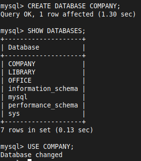
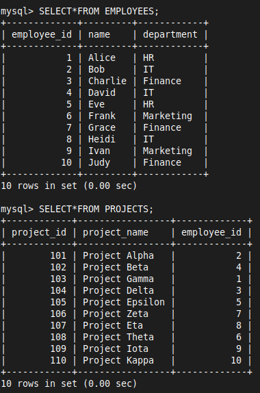

# CASE STUDY - COMPANY 01

# Problem Statement
A company needs to maintain records of its employees and the projects they are assigned to. The company has several departments, and each employee belongs to a specific department. Projects are managed by the employees, and the company needs to track which employee is responsible for each project.

The company wants to store the following information in a database:
- Employee details including their department
- Project details including which employee is managing each project
- The ability to retrieve and analyze employee and project data efficiently

# Database Schema

| Entity    | Attribute                                         | Primary Key       | Foreign Key              |
| --------- | ------------------------------------------------- | ----------------- | ------------------------ |
| EMPLOYEES | employee_id, name, department                     | employee_id       |                          |
| PROJECTS  | project_id, project_name, employee_id             | project_id        | employee_id              |

## SQL - DDL

### 1. Create and Use Database

```sql
CREATE DATABASE COMPANY;
```

```sql
USE COMPANY;
```



### 2. Creating Tables

```sql
CREATE TABLE EMPLOYEES (
    employee_id INT PRIMARY KEY,
    name VARCHAR(50) NOT NULL,
    department VARCHAR(50)
);
```

```sql
CREATE TABLE PROJECTS (
    project_id INT PRIMARY KEY,
    project_name VARCHAR(50) NOT NULL,
    employee_id INT,
    FOREIGN KEY (employee_id) REFERENCES EMPLOYEES(employee_id) ON DELETE CASCADE ON UPDATE CASCADE
);
```


### 3. Inserting Values

```sql
INSERT INTO EMPLOYEES (employee_id, name, department) VALUES
(1, 'Alice', 'HR'),
(2, 'Bob', 'IT'),
(3, 'Charlie', 'Finance'),
(4, 'David', 'IT'),
(5, 'Eve', 'HR'),
(6, 'Frank', 'Marketing'),
(7, 'Grace', 'Finance'),
(8, 'Heidi', 'IT'),
(9, 'Ivan', 'Marketing'),
(10, 'Judy', 'Finance');
```

```sql
INSERT INTO PROJECTS (project_id, project_name, employee_id) VALUES
(101, 'Project Alpha', 2),
(102, 'Project Beta', 4),
(103, 'Project Gamma', 1),
(104, 'Project Delta', 3),
(105, 'Project Epsilon', 5),
(106, 'Project Zeta', 7),
(107, 'Project Eta', 8),
(108, 'Project Theta', 6),
(109, 'Project Iota', 9),
(110, 'Project Kappa', 10);
```



