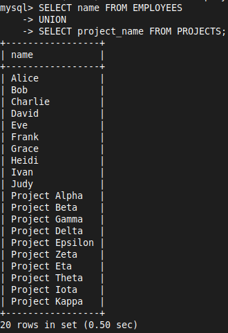
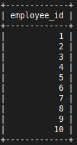
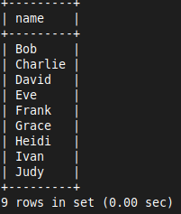
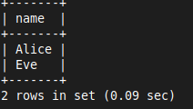
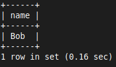
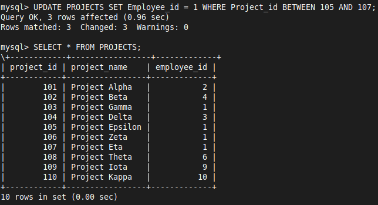
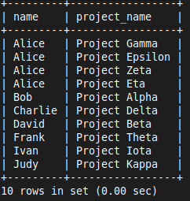
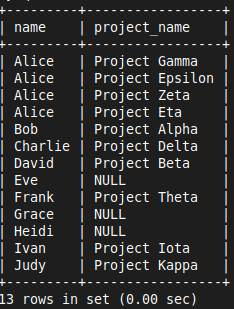
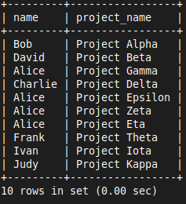
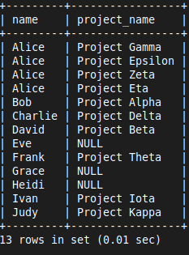

# CASE STUDY - COMPANY 02

# Set Operators, Nested Queries & Joins
## 1. **Set Operators**

- **UNION**

```sql
SELECT name FROM EMPLOYEES
UNION
SELECT project_name FROM PROJECTS;
```



- **INTERSECT**

```sql
SELECT employee_id  FROM EMPLOYEES 
INTERSECT 
SELECT employee_id FROM PROJECTS;
```



- **EXCEPT**

```sql
SELECT name FROM EMPLOYEES
EXCEPT
SELECT 'Alice' AS name FROM PROJECTS;
```



## 2. **Nested Queries (Subqueries)**

- **Subquery in a WHERE Clause**
	- This query finds all employees who work in the same department as 'Alice'

```sql
SELECT name FROM EMPLOYEES
WHERE department = (SELECT department FROM EMPLOYEES WHERE name = 'Alice');
```



- **Subquery with `IN`**
	- This query finds the names of employees who are working on 'Project Alpha'

```sql
SELECT name FROM EMPLOYEES
WHERE employee_id IN 
	(SELECT employee_id FROM PROJECTS WHERE project_name = 'Project Alpha');
```



## 3. **Joins**



- **INNER JOIN**
	- This query retrieves the names of employees and their respective project names

```sql
SELECT EMPLOYEES.name, PROJECTS.project_name
FROM EMPLOYEES
INNER JOIN PROJECTS ON EMPLOYEES.employee_id = PROJECTS.employee_id;
```



- **LEFT JOIN** (or **LEFT OUTER JOIN**)
	- This query retrieves all employees, even those who are not assigned to any projects

```sql
SELECT EMPLOYEES.name, PROJECTS.project_name
FROM EMPLOYEES
LEFT JOIN PROJECTS ON EMPLOYEES.employee_id = PROJECTS.employee_id;
```



- **RIGHT JOIN** (or **RIGHT OUTER JOIN**)
	- This query retrieves all projects, including those that do not have any employees assigned

```sql
SELECT EMPLOYEES.name, PROJECTS.project_name
FROM EMPLOYEES
RIGHT JOIN PROJECTS ON EMPLOYEES.employee_id = PROJECTS.employee_id;
```



- **FULL JOIN** (or **FULL OUTER JOIN**)
	- This query retrieves all employees and all projects, matching them where possible

```sql
SELECT EMPLOYEES.name, PROJECTS.project_name
FROM EMPLOYEES
LEFT JOIN PROJECTS ON EMPLOYEES.employee_id = PROJECTS.employee_id

UNION

SELECT EMPLOYEES.name, PROJECTS.project_name
FROM PROJECTS
RIGHT JOIN EMPLOYEES ON EMPLOYEES.employee_id = PROJECTS.employee_id;
```

