# CASE STUDY - LIBRARY

# Problem Statement
- A Library wants to maintain the record of books, members, book issue, book returns and fines collected for late returns in a database
- The database can be loaded with the book information
- Students can register with the library to be a member
- Books can be issued to students with valid library membership
- A student can keep an issued book with him/her for a maximum period of 2 weeks from the date of issue, beyond which a fine will be charged
- Fine is calculated on the delay in days of return for 1-7 days 2Rs , 8-30 days 10Rs and above 30 days 5Rs will be charged per day

# Database Schema

| Entity        | Attribute                                                                      | Primary Key        | Foreign Key              |
| ------------- | ------------------------------------------------------------------------------ | ------------------ | ------------------------ |
| BOOK          | Book_id, Title, Language_id, MRP, Publisher_id, Published_date, Volume, Status | Book_id            | Language_id, Pblisher_id |
| AUTHOR        | Author_id, Name, Email, Phone, Status                                          | Author_id          |                          |
| BOOK_AUTHOR   | Book_id, Author_id                                                             | Book_id, Author_id | Book_id, Author_id       |
| PUBLISHER     | Publisher_id, Name, Address                                                    | Publisher_id       |                          |
| MEMBER        | Member_id, Name, Branch_code, Roll_no, Phone, Email, Date_of_join, Status      | Member_id          |                          |
| BOOK_ISSUE    | Issue_id, Date_of_issue, Book_id, Member_id, Expected_date_of_return, Status   | Issue_id           | Book_id, Member_id       |
| BOOK_RETURN   | Issue_id, Actual_date_of_return, Late_days, Late_fee                           | Issue_id           | Issue_id                 |
| LANGUAGE      | Language_id, Name                                                              | Language_id        |                          |
| LATE_FEE_RULE | FromDays, ToDays, Amount                                                       | composite          | key                      |

# SQL
### 1. Create and Use Database

```SQL
CREATE DATABASE LIBRARY;
```

```SQL
USE LIBRARY;
```

### 2. Creating Tables


```SQL
CREATE TABLE BOOK (
    Book_id INT PRIMARY KEY,
    Title VARCHAR(255) NOT NULL,
    Language_id INT,
    MRP DECIMAL(10, 2),
    Publisher_id INT,
    Published_date DATE,
    Volume VARCHAR(50),
    Status VARCHAR(50),
);
```

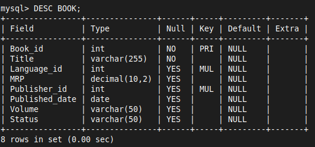

```SQL
CREATE TABLE AUTHOR (
    Author_id INT PRIMARY KEY AUTO_INCREMENT,
    Name VARCHAR(255) NOT NULL,
    Email VARCHAR(255),
    Phone VARCHAR(15),
    Status VARCHAR(50)
);
```

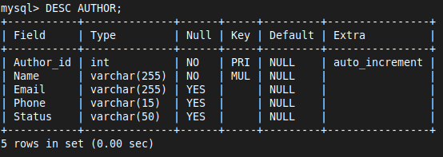

```SQL
CREATE TABLE BOOK_AUTHOR (
    Book_id INT,
    Author_id INT,
    PRIMARY KEY (Book_id, Author_id),
    FOREIGN KEY (Book_id) REFERENCES BOOK(Book_id),
    FOREIGN KEY (Author_id) REFERENCES AUTHOR(Author_id)
);
```

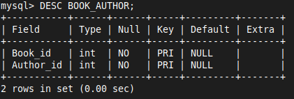

```SQL
CREATE TABLE PUBLISHER (
    Publisher_id INT PRIMARY KEY,
    Name VARCHAR(255) NOT NULL,
    Address VARCHAR(255)
);
```

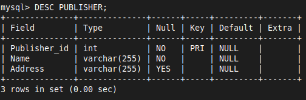

```SQL
CREATE TABLE MEMBER (
    Member_id INT PRIMARY KEY,
    Name VARCHAR(255) NOT NULL,
    Branch_code VARCHAR(50),
    Roll_no VARCHAR(50),
    Phone VARCHAR(15),
    Email VARCHAR(255),
    Date_of_join DATE,
    Status VARCHAR(50)
);
```

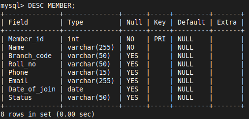

```SQL
CREATE TABLE BOOK_ISSUE (
    Issue_id INT PRIMARY KEY,
    Date_of_issue DATE NOT NULL,
    Book_id INT,
    Member_id INT,
    Expected_date_of_return DATE,
    Status VARCHAR(50),
    FOREIGN KEY (Book_id) REFERENCES BOOK(Book_id) ON DELETE CASCADE ON UPDATE       CASCADE,
    FOREIGN KEY (Member_id) REFERENCES MEMBER(Member_id) ON DELETE CASCADE ON        UPDATE CASCADE
);
```

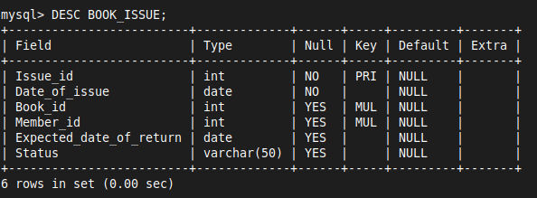

```SQL
CREATE TABLE BOOK_RETURN (
    Issue_id INT PRIMARY KEY,
    Actual_date_of_return DATE,
    Late_days INT,
    Late_fee DECIMAL(10, 2),
    FOREIGN KEY (Issue_id) REFERENCES BOOK_ISSUE(Issue_id) ON DELETE CASCADE ON      UPDATE CASCADE
);
```

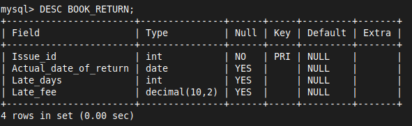

```SQL
CREATE TABLE LANGUAGE (
    Language_id INT PRIMARY KEY,
    Name VARCHAR(50) NOT NULL
);
```

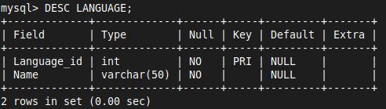

```SQL
CREATE TABLE LATE_FEE_RULE (
    FromDays INT,
    ToDays INT,
    Amount DECIMAL(10, 2),
    PRIMARY KEY (FromDays, ToDays)
);
```


### 3. Adding Foreign Key After Creating the Table
```SQL
ALTER TABLE BOOK
ADD CONSTRAINT fk_language FOREIGN KEY (Language_id) REFERENCES LANGUAGE(Language_id);
```

```SQL
ALTER TABLE BOOK
ADD CONSTRAINT fk_publisher FOREIGN KEY (Publisher_id) REFERENCES PUBLISHER(Publisher_id);
```

### 4. Changing Data Type After Creating the Table
```SQL
-- Change the data type of the Status column in the BOOK table
ALTER TABLE BOOK
MODIFY Status TINYINT(1);
```

### 5. To Add ON DELETE CASCADE & ON UPDATE CASCADE  After Creating the Table

- **ON DELETE CASCADE**: When a row in the parent table (e.g., `BOOK`) is deleted, all corresponding rows in the child table (`BOOK_ISSUE`) will also be deleted automatically
  
- **ON UPDATE CASCADE**: When the primary key in the parent table is updated, the foreign key in the child table will automatically be updated to match

1. **Identify the Existing Foreign Key Constraints**
	 - Before dropping a foreign key, you need to know its name. You can retrieve the foreign key constraints using

```SQL
SHOW CREATE TABLE table_name;
```

2. **Drop Existing Foreign Key Constraints**
	- If you need to remove existing foreign key constraints, use the names identified from the previous step

```SQL
ALTER TABLE BOOK
DROP FOREIGN KEY fk_language;
```

```SQL
ALTER TABLE BOOK
DROP FOREIGN KEY fk_publisher;
```

3. **Add New Foreign Key Constraints with Cascading Options**
	- After removing the existing constraints, you can add new foreign key constraints with `ON DELETE CASCADE` and `ON UPDATE CASCADE`

```SQL
-- Add foreign key constraint for Language_id with ON DELETE CASCADE and ON UPDATE CASCADE
ALTER TABLE BOOK
ADD CONSTRAINT fk_language
FOREIGN KEY (Language_id)
REFERENCES LANGUAGE(Language_id)
ON DELETE CASCADE
ON UPDATE CASCADE;
```

```SQL
-- Add foreign key constraint for Publisher_id with ON DELETE CASCADE and ON UPDATE CASCADE
ALTER TABLE BOOK
ADD CONSTRAINT fk_publisher
FOREIGN KEY (Publisher_id)
REFERENCES PUBLISHER(Publisher_id)
ON DELETE CASCADE
ON UPDATE CASCADE;
```

4. **If foreign key was declared while creating the table ( not case2)**

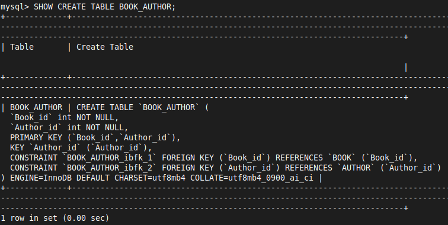

```SQL
ALTER TABLE BOOK_AUTHOR
DROP FOREIGN KEY BOOK_AUTHOR_ibfk_1;
```

```SQL
ALTER TABLE BOOK_AUTHOR
DROP FOREIGN KEY BOOK_AUTHOR_ibfk_2;
```

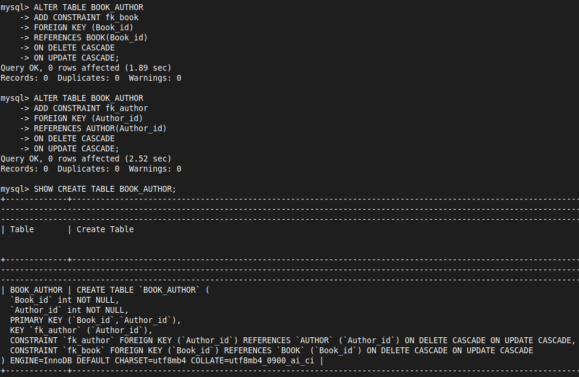

### 6. Indexing
- To confirm that the index is being used, you can use the `EXPLAIN` command before your query
- This command provides information about how MySQL executes your query, including whether it uses indexes

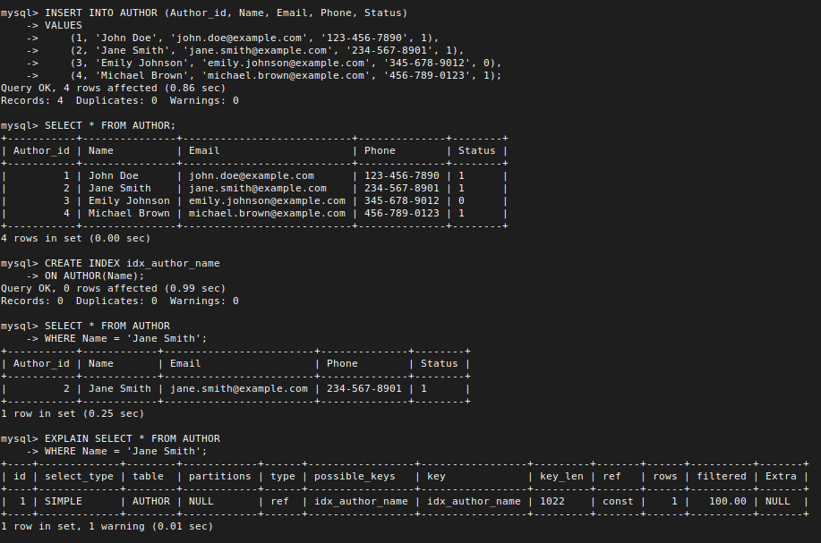