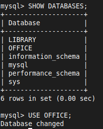
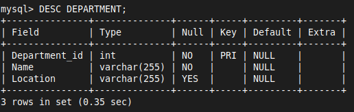
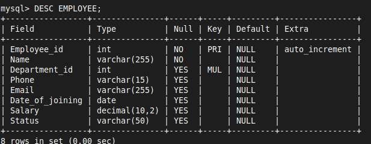
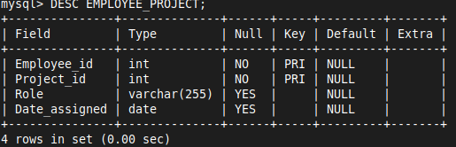
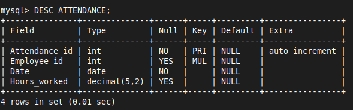
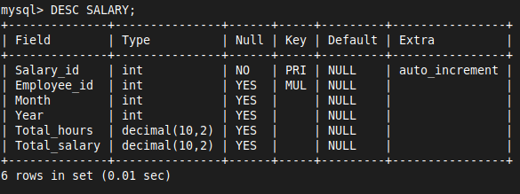

# CASE STUDY - OFFICE 01

# Problem Statement
- An office wants to maintain records of employees, departments, projects, employee assignments, attendance, and salary payments in a database
- The database can be loaded with employee and department information
- Employees can be assigned to projects
- Attendance is tracked daily for each employee
- Salary is calculated based on the attendance and the hourly rate

# Database Schema

| Entity       | Attribute                                                                      | Primary Key | Foreign Key        |
|--------------|--------------------------------------------------------------------------------|-------------|--------------------|
| EMPLOYEE     | Employee_id, Name, Department_id, Phone, Email, Date_of_joining, Salary, Status| Employee_id | Department_id      |
| DEPARTMENT   | Department_id, Name, Location                                                  | Department_id|                    |
| PROJECT      | Project_id, Name, Start_date, End_date, Status                                 | Project_id  |                    |
| EMPLOYEE_PROJECT | Employee_id, Project_id, Role, Date_assigned                               | Employee_id, Project_id | Employee_id, Project_id |
| ATTENDANCE   | Attendance_id, Employee_id, Date, Hours_worked                                 | Attendance_id| Employee_id        |
| SALARY       | Salary_id, Employee_id, Month, Year, Total_hours, Total_salary                 | Salary_id   | Employee_id        |

# SQL - DDL

### 1. Create and Use Database

```SQL
CREATE DATABASE OFFICE;
USE OFFICE;
```



### 2. Creating Tables

```SQL
CREATE TABLE DEPARTMENT (
    Department_id INT PRIMARY KEY,
    Name VARCHAR(255) NOT NULL,
    Location VARCHAR(255)
);
```



```SQL
CREATE TABLE EMPLOYEE (
    Employee_id INT PRIMARY KEY AUTO_INCREMENT,
    Name VARCHAR(255) NOT NULL,
    Department_id INT,
    Phone VARCHAR(15),
    Email VARCHAR(255),
    Date_of_joining DATE,
    Salary DECIMAL(10, 2),
    Status VARCHAR(50),
    FOREIGN KEY (Department_id) REFERENCES DEPARTMENT(Department_id) ON DELETE CASCADE ON UPDATE CASCADE
);
```



```SQL
CREATE TABLE PROJECT (
    Project_id INT PRIMARY KEY AUTO_INCREMENT,
    Name VARCHAR(255) NOT NULL,
    Start_date DATE,
    End_date DATE,
    Status VARCHAR(50)
);
```


```SQL
CREATE TABLE EMPLOYEE_PROJECT (
    Employee_id INT,
    Project_id INT,
    Role VARCHAR(255),
    Date_assigned DATE,
    PRIMARY KEY (Employee_id, Project_id),
    FOREIGN KEY (Employee_id) REFERENCES EMPLOYEE(Employee_id) ON DELETE CASCADE ON UPDATE CASCADE,
    FOREIGN KEY (Project_id) REFERENCES PROJECT(Project_id) ON DELETE CASCADE ON UPDATE CASCADE
);
```



```SQL
CREATE TABLE ATTENDANCE (
    Attendance_id INT PRIMARY KEY AUTO_INCREMENT,
    Employee_id INT,
    Date DATE NOT NULL,
    Hours_worked DECIMAL(5, 2),
    FOREIGN KEY (Employee_id) REFERENCES EMPLOYEE(Employee_id) ON DELETE CASCADE ON UPDATE CASCADE
);
```



```SQL
CREATE TABLE SALARY (
    Salary_id INT PRIMARY KEY AUTO_INCREMENT,
    Employee_id INT,
    Month INT,
    Year INT,
    Total_hours DECIMAL(10, 2),
    Total_salary DECIMAL(10, 2),
    FOREIGN KEY (Employee_id) REFERENCES EMPLOYEE(Employee_id) ON DELETE CASCADE ON UPDATE CASCADE
);
```


