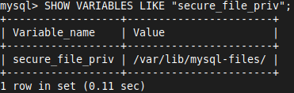

# Setup MySQL

### **01 Install MySQL Server**

```bash
sudo apt update
```

```bash
sudo apt install mysql-server
```

### **02 Start the MySQL Service**

```bash
sudo service mysql start
```

- To enable MySQL to start on boot

```bash
sudo systemctl enable mysql
```

### **03 Secure MySQL Installation**
- MySQL provides a security script to improve the security of your MySQL installation

```bash
sudo mysql_secure_installation
```

- You'll be prompted to set up a root password, remove anonymous users, disallow root login remotely, remove test databases, and reload privilege tables. It's recommended to answer 'Yes' to all prompts

### **04 Access MySQL from the Terminal**

```bash
mysql -u root -p
```

- **`-u root`** specifies the username (root)
- **`-p`** prompts you to enter the root password you set during installation

### **Access MySQL as the System Root User**
- You need to log in to MySQL as the system's root user without requiring a password

```bash
sudo mysql
```

- This command should give you direct access to the MySQL shell

### **Change the Authentication Method for MySQL Root User**
- Once inside the MySQL shell, change the root user's authentication method to the traditional password-based method

```sql
USE mysql;
```

```SQL
ALTER USER 'root'@'localhost' IDENTIFIED WITH mysql_native_password BY 'your_password';
```

```SQL
FLUSH PRIVILEGES;
```

```SQL
exit;
```

- Replace `'your_password'` with a secure password of your choice

### **Reattempt Login with Password**
- Now, try logging in again with the new password you set

```bash
mysql -u root -p
```

- This process changes the root user's authentication method from `auth_socket` to `mysql_native_password`, allowing you to log in with a password
- After this, you should be able to access MySQL as the root user using the password you set

### **Optional: Revert Back to auth_socket**
- If you want to revert to the `auth_socket` method 

```bash
sudo mysql
```

```sql
USE mysql;
```

```SQL
ALTER USER 'root'@'localhost' IDENTIFIED WITH auth_socket;
```

```SQL
FLUSH PRIVILEGES;
```

```SQL
exit;
```

- This will revert the authentication method to the default `auth_socket`

### **05 Create a User and Grant Privileges (Optional)**
- You can create a new MySQL user and grant privileges

```sql
CREATE USER 'newuser'@'localhost' IDENTIFIED BY 'password';
GRANT ALL PRIVILEGES ON *.* TO 'newuser'@'localhost' WITH GRANT OPTION;
FLUSH PRIVILEGES;
```

- Replace `'newuser'` with the desired username
- Replace `'password'` with the desired password

### **06 Access MySQL with the New User (Optional)**
- You can now access MySQL using the new user account

```bash
mysql -u newuser -p
```

- Enter the password you set for the new user

### **07 Exit MySQL**
To exit the MySQL shell, type:

```sql
exit;
```

# Database Initialization Using Bulk Import
- Using MySQL command-line
- **Bulk Import** in MySQL Workbench allows you to quickly load large amounts of data into a database table from a file, such as a CSV or SQL dump file

```SQL
SHOW VARIABLES LIKE "secure_file_priv"
```



- Move the CSV file to `/var/lib.mysql-files/`

```bash
sudo cp table_name.csv /var/lib.mysql-files/
```

- Load data into table (table_name)

```SQL
LOAD DATA INFILE '/var/lib.mysql-files/table_name.csv' 
INTO TABLE table_name 
FIELDS TERMINATED BY ','
ENCLOSED BY '"'
LINES TERMINATED BY "\n"
IGNORE 1 ROWS;
```

